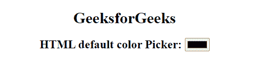
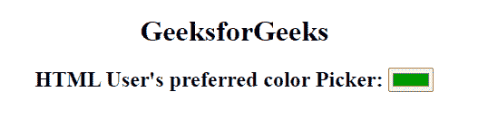

# HTML 颜色选择器

> 原文: [https://www.geeksforgeeks.org/html-color-picker/](https://www.geeksforgeeks.org/html-color-picker/)

在本文中，我们将了解 HTML 颜色选择器并通过示例了解它的实现。HTML 中的 `type="color"` 输入元素为用户提供了一个界面，用户可以从默认的拾色器中选择一种颜色进行交互，或者通过在 RGB 字段中给出所需的值来设计自己的颜色。

**语法:**

```html
<input type="color" value="#228c4e">
```

*   **类型**：指定要显示的 `<input>` 元素的类型。默认值为文本。
*   **值**：它指定使用它的元素的值或用于指定输入元素的初始值。

**实现步骤:**

*   在 `<body>` 标签内使用 `<input>` 标签。
*   使用 `type` 属性和 `<input>` 元素。
*   将 `type` 属性定义为 "颜色"。

**示例 1:** 在本例中，我们将放置默认的颜色选择器。

```html
<!DOCTYPE html>
<html>

<body style="text-align: center;">
    <h1>
        GeeksforGeeks
    </h1>
    <h2>
        HTML default color Picker:
    </h2> 
    <input type="color">
</body>

</html>
```

**输出:**拾色器的默认值为 `#000000(黑色)`。用户可以在 `value` 属性的帮助下指定自己的拾色器色调。



**示例 2:** 在本例中，我们将使用 `value` 属性将默认颜色设置为绿色。

```html
<!DOCTYPE html>
<html>

<body style="text-align: center;">
    <h1>
        GeeksforGeeks
    </h1>
    <h2>
        HTML User's preferred color Picker:
    </h2> 
    <input type="color" value="#009900">
</body>

</html>
```

**输出:**文本在 RGB 字段中的值可以根据方便随时更改，并且会生成新的颜色。



**支持的浏览器:**

*   谷歌 Chrome 20.0
*   微软边缘 14.0
*   Firefox 29.0
*   Opera 12.0
*   Safari 12.1
