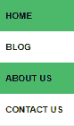
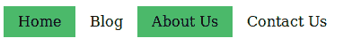

# HTML & CSS | Tabindex Attribute & Navigation Bars

> 原文: [https://www.geeksforgeeks.org/html-css-tabindex-attribute-navigation-bars/](https://www.geeksforgeeks.org/html-css-tabindex-attribute-navigation-bars/)

The `tabindex` attribute specifies the tab order of elements. The "tab" button is used for navigation. The `tabindex` content attribute allows users to control whether an element should be focusable, whether it should be navigable using the tab order, and what the relative order of the element is for tab order navigation.
**Syntax:**

```html
element tabindex = "number" 
```

**Attributes:**

*   ***Number***: Specifies the "tab" order for navigation.

**Example:**

```html
<div tabindex = "0"><p>GFG Article 1</P></div>
<div tabindex = "1"><p>GFG Article 2</P></div>
<div tabindex = "2"><p>GFG Article 3</P></div>
```

In the above example, when navigating elements using the tab key, the **first** one will be focused first, followed by the **second** and then the **third**.

**Note:** If the `tabindex` value is -1, it will not be focusable. For example, the following link will not be focused when navigating with the tab key.
Example:

```html
<a href="#" tabindex="-1">Tab key cannot reach here!</a>
```

**Navigation Bars:**
Navigation bars are important for any website. They are blocks associated with links to different pages of the website.

Navigation menus have two types:

*   Vertical navigation bar
*   Horizontal navigation bar

**Vertical Navigation Bar:** The vertical navigation bar menu displays vertically.
**Example:**

**Code:**

```html
<style>
    ul {
        list-style-type: none;
        margin: 0;
        padding: 0;
        width: 20%;
        background-color: white;
        position: fixed;
        height: 25%;
        overflow: hidden;
    }

li a {
        display: block;
        color: #000;
        padding: 8px 16px;
        text-decoration: none;
    }

.hme {
        background-color: #4CB96B;
    }
</style>

<body>
    <ul>
        <li><a class="hme" href="#" tabindex="2">Home</a></li>
        <li><a href="#" tabindex="1">Blog</a></li>
        <li><a class="hme" href="#" tabindex="4">About Us</a></li>
        <li><a href="#a" tabindex="3">Contact Us</a></li>
    </ul>
</body>
```

**Horizontal Navigation Bar:** The horizontal navigation bar menu displays one after another or side by side.
**Example:**


**Code:**

```html
<style>
    ul {
        list-style-type: none;
        margin: 0;
        padding: 0;
        background-color: white;
        height: 25%;
        overflow: hidden;
    }

li {
        float: left;
    }

li a {
        display: block;
        color: #000;
        padding: 8px 16px;
        text-decoration: none;
    }

.hme {
        background-color: #4CB96B
    }
</style>

<body>
    <ul>
        <li><a class="hme" href="#" tabindex="1">Home</a></li>
        <li><a href="#" tabindex="2">Blog</a></li>
        <li><a class="hme" href="#" tabindex="3">About Us</a></li>
        <li><a href="#" tabindex="4">Contact Us</a></li>
    </ul>
</body>
```
