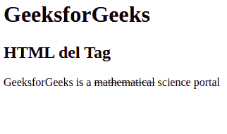

# HTML del 标签

> [HTML del 标签](https://www.geeksforgeeks.org/html-del-attribute/)

HTML 中的 `<del>` 标签代表删除，用于标记已经从文档中删除的部分文本。被删除的文本被网页浏览器渲染为删除文本，虽然这个属性可以使用 [CSS 文本修饰属性](https://www.geeksforgeeks.org/css-text-decoration-property/) 来改变。`<del>` 标签需要一个开始和结束标签。`~~`

**属性:** `<del>` 标签包含以下列出的两个属性:

*   **引用:** 用于指定表示删除文本原因的文档或消息的网址。
*   **datetime:** 用于指定删除文本的日期和时间。

**语法:**

```html
<del> Contents... </del>
```

**示例 1:** 以下示例说明了 HTML 中的 `<del>` 元素:

```html
<!DOCTYPE html>
<html>
    <body>
        <h1>GeeksforGeeks</h1>
        <h2>HTML del Tag</h2>
        <!-- HTML del tag is used in paragraph Tag -->

<p>GeeksforGeeks is a <del>mathematical</del>
           science portal</p>

</body>
</html>
```

**输出:**


**示例 2:** 本示例使用带有日期时间属性的 `<del>` 标签。

```html
<!DOCTYPE html>
<html>
    <body>
        <h1>GeeksforGeeks</h1>
        <h2>HTML del Tag</h2>
        <!-- HTML del tag is used in paragraph Tag -->

<p>GeeksforGeeks is a <del datetime="2023-04-01">mathematical</del>
           science portal</p>

</body>
</html>
```

**输出:**



**支持的浏览器:**

*   谷歌 Chrome
*   微软公司出品的 web 浏览器
*   Firefox 1 及以上版本
*   歌剧
*   旅行队
*   边缘
