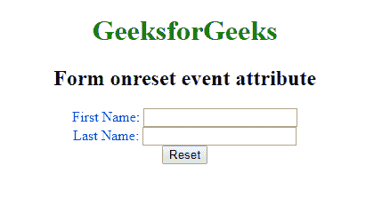

# HTML |

## onreset Attribute

> 原文: [https://www.geeksforgeeks.org/html-form-onreset-attribute/](https://www.geeksforgeeks.org/html-form-onreset-attribute/)

The `onreset` attribute in HTML `<form>` is used to specify a script that should be executed when the form fields are reset.

## Syntax:

```html
<form onreset="script">
```

## Attribute Values: The attribute contains a single-value script that is valid when the event is called.

## Example:

```html
<!DOCTYPE html > 
<html> 
    <head> 
        <title>
            HTML form onreset attribute
        </title>

<style> 
            body { 
                text-align:center; 
            } 
            h1 { 
                color:green; 
            } 
        </style>

<script> 
            function Geeks() { 
                alert("Form Reset...") ; 
            } 
        </script > 
    </head>

<body> 
        <h1>GeeksforGeeks</h1> 
        <h2>Form onreset event attribute</h2>

<form onreset="Geeks()" style="color:blue;"> 
            First Name: <input type="text"></br> 
            Last Name: <input type="text"></br> 
            <input type="reset"> 
        </form> 
    </body> 
</html>                    
```

## Output:


## Supported Browsers: The `<form>` element with the `onreset` attribute is supported by the following browsers:

*   Google Chrome
*   Microsoft Edge
*   Firefox
*   Safari
*   Opera

</form>
