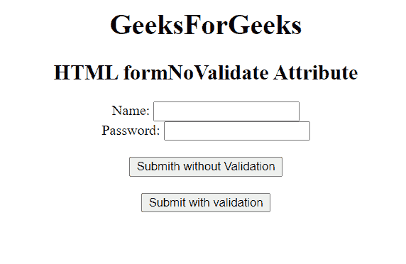

# HTML 表单模板属性

> 原文: [https://www.geeksforgeeks.org/html-formnovalidate-attribute/](https://www.geeksforgeeks.org/html-formnovalidate-attribute/)

## HTML formnovalidate 属性

第 **e HTML formnovalidate 属性**用于 **<input>** 和 **<button>** 元素。此属性用于定义在将数据发送到服务器之前不得验证表单数据。它是一个布尔属性，覆盖了 `<form>` 标签的 **newdata** 属性的特征。它是一个布尔属性，指示如果设置了它，则意味着在提交表单时不应该验证表单，否则必须验证表单。

## 用途

用于绕过旁路验证流程，让用户轻松保存表单填写进度，没有任何障碍。

## 支持的标签

*   **<button>**
*   **<input type="submit">** 和 **<input type="image">**

## 语法

```html
<element formnovalidate>
```

## 示例

下面的代码用 `<button>` 元素说明了 formNoValidate 属性。

## 超文本标记语言

```html
<!DOCTYPE html>
<html>

<head>
    <title>
        HTML formNoValidate Attribute
    </title>
</head>

<body style="text-align:center;">
    <h1>
        GeeksForGeeks
    </h1>

<h2>
        HTML formNoValidate Attribute
    </h2>

<form action="#"
        method="get"
        target="_self">
        Name:
        <input type="text">
        <br> Password:
        <input type="password">
        <br>
        <br>
        <button type="submit"
                id="Geeks"
                name="myGeeks"
                value="Submit @ geeksforgeeks"
                formTarget="_blank"
                formnovalidate>
            Submit without Validation
        </button>
        <br>
        <br>
        <button type="submit">
        Submit with validation
    </button>
    </form>

</body>

</html>
```

## 输出



## 支持的浏览器

*   谷歌 Chrome
*   微软公司出品的 web 浏览器
*   歌剧
*   苹果野生动物园
*   火狐浏览器
