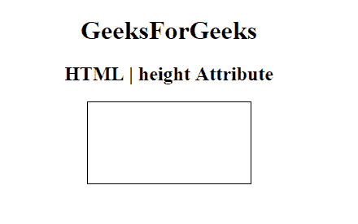

# HTML | Height Attribute

> 原文: [https://www.geeksforgeeks.org/html-height-attribute/](https://www.geeksforgeeks.org/html-height-attribute/)

**HTML | Height Attribute** is used to specify the height of an element. It can be applied to the following elements:

*   `<canvas>`
*   `<embed>`
*   `<iframe>`
*   ``
*   `<object>`
*   `<input>`

**Example:** This example demonstrates the use of the height attribute in the `<canvas>` element.

```html
<!DOCTYPE html>
<html>

<head>
    <title>
      HTML | height Attribute
    </title>
</head>

<body style="text-align:center">
    <h1>GeeksForGeeks</h1>
    <h2>HTML | height Attribute</h2>
    <!-- canvas Tag starts here -->
    <canvas id="GeeksforGeeks"
            width="200"
            height="100"
            style="border:1px solid black">
    </canvas>
    <!-- canvas Tag ends here -->

</body>

</html>
```

**Output:**



**Supported Browsers:** The HTML height attribute is supported by the following browsers:

*   Google Chrome
*   Microsoft Edge
*   Firefox
*   Opera
*   Safari
