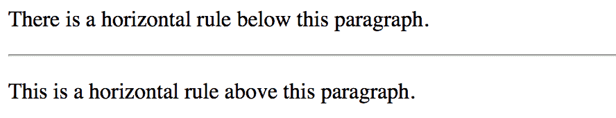
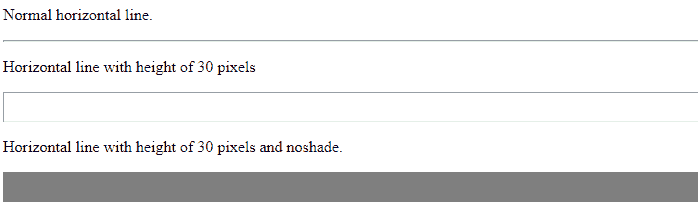

# HTML

## 标签

> [HTML HR 标签](https://www.geeksforgeeks.org/html-hr-tag/)

HTML 中的 `<hr>` 标记代表水平规则，用于在 HTML 页面中插入水平规则或主题分隔符，以划分或分隔文档部分。

## 标签属性

下面给出的表格描述了 `<hr>` 标签属性:

```html
<figure class="table">
| attribute | value | explain |
| --- | --- | --- |
| Alignment | Zuoyou | Used to specify the alignment of horizontal lines. |
| 无阴影 | 没有阴影 | Used to specify bars without shading effect. |
| dimension | pixel | Used to specify the height of the horizontal line. |
| Width | pixel | Used to specify the width of the horizontal line. |
</figure>
```

## 语法

```html
<hr> ...
```

## 示例

### 超文本标记语言

```html
<!DOCTYPE html>

<html>

<body>

<p>There is a horizontal rule below this paragraph.</p>

<!--HTML hr tag is used here-->
        <hr>

<p>This is a horizontal rule above this paragraph.</p>

</body>

</html>
```

### 输出



### 超文本标记语言（带属性的 hr 标签）

```html
<!DOCTYPE html>

<html>

<body>

<p>Normal horizontal line.</p>

<!--HTML hr tag is used here-->
        <hr>

<p>Horizontal line with height of 30 pixels</p>

<hr size="30">

<p>Horizontal line with height of 30 pixels and noshade.</p>

<hr size="30" noshade>

</body>

</html>
```

### 输出



## 支持的浏览器

*   谷歌 Chrome
*   微软公司出品的 web 浏览器
*   火狐浏览器
*   歌剧
*   旅行队

HTML 是网页的基础，通过构建网站和网络应用程序用于网页开发。您可以通过以下 [HTML 教程](https://www.geeksforgeeks.org/html-tutorials/)和 [HTML 示例](https://www.geeksforgeeks.org/html-examples/)从头开始学习 HTML。

CSS 是网页的基础，通过设计网站和网络应用程序用于网页开发。你可以通过以下 [CSS 教程](https://www.geeksforgeeks.org/css-tutorials/)和 [CSS 示例](https://www.geeksforgeeks.org/css-examples/)从头开始学习 CSS。
