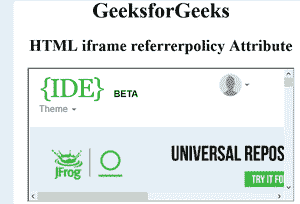

# HTML iframe referrer policy 属性

> 原文: [https://www.geeksforgeeks.org/html-iframe-referrerpolicy-attribute/](https://www.geeksforgeeks.org/html-iframe-referrerpolicy-attribute/)

**HTML `<iframe>` referrerpolicy 属性** 用于指定获取结果时将发送的引用信息。

**语法**

```html
<iframe referrerpolicy="value">
```

**属性值:**

1.  **no-referrer**: 指定不会随请求一起发送引用信息。
2.  **no-referrer-when-downgrade**: 有默认值。它指定引用头将不会发送到没有 HTTPS 的源。
3.  **origin**: 指定在所有情况下只发送文档的来源作为引用信息。
4.  **origin-when-cross-origin**: 执行同原点请求时发送原点、路径、查询字符串，其他情况只发送单据的原点。
5.  **same-origin**: 指定将为同站点源发送推荐人，但跨源请求将不发送推荐人信息。
6.  **strict-origin**: 它只在协议安全级别保持不变 (HTTPS/HTTPS) 的情况下发送文档的来源作为引用者，但不发送到不太安全的目的地 (HTTPS/HTTP)。
7.  **strict-origin-when-cross-origin**: 它在执行同起源请求时发送起源、路径和 querystring，在执行跨起源请求时仅在协议安全级别保持不变时发送起源 (HTTPS/HTTPS)，不向任何不太安全的目的地发送报头 (HTTPS/HTTP)。

**示例:**

## 超文本标记语言

```html
<!DOCTYPE html> 
<html>

<head> 
    <title> 
        HTML iframe referrerpolicy Attribute 
    </title> 
</head>

<body style="text-align:center;"> 
    <h1>GeeksforGeeks</h1>

<h2> 
        HTML iframe referrerpolicy Attribute 
    </h2>

<iframe src="https://ide.geeksforgeeks.org/index.php"
        height="200" width="400" 
        referrerpolicy="no-referrer">
    </iframe> 
</body>

</html>
```

**输出:**



**支持的浏览器:**

*   谷歌 Chrome
*   微软公司出品的 web 浏览器
*   火狐浏览器
*   旅行队
*   歌剧
