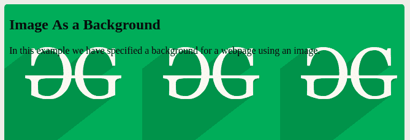

# HTML 图片

> 原文: [https://www.geeksforgeeks.org/html-images/](https://www.geeksforgeeks.org/html-images/)

在本文中，我们将了解 **HTML 图像**，如何在 HTML 中添加图像，以及通过示例了解其实现和用法。在早期，网页只包含文本内容，这使得它们显得非常无聊和无趣。幸运的是，为用户添加在网页上嵌入图像的功能还不够长。在这篇文章中，我们将了解如何在网页上添加图像，这将使网站具有吸引力并插入图像的各种方法。

将图像插入网页有两种方法:

*   通过提供访问互联网文件的完整路径或地址（URL）。
*   通过提供相对于当前网页文件位置的文件路径。

我们将首先讨论将图像插入网页，同时，我们将理解上述两种方法。

## 在网页上添加图像

`` 标签用于将图像添加或嵌入到网页/网站中。“img”标签是一个空标签，这意味着它只能包含属性列表，并且没有结束标签。图像的添加随着网页的设计结构、外观的增强而提高了质量。如今，网站不会直接向网页添加图像，因为图像是通过使用保存图像空间的 `` 标签链接到网页的。

### 语法

```html

```

### 属性

`` 标签具有以下属性:

*   **src**: 用于指定图像的路径。
*   **alt**: 用于为图像指定替代文本。它非常有用，因为它可以通知用户图像的含义，并且由于任何网络问题，如果图像无法显示，则会显示该替代文本。
*   **crossorigin**: 用于从允许跨产地访问的第三方网站导入图片与画布一起使用。
*   **height**: 用于指定图像的高度。
*   **width**: 用于指定图像的宽度。
*   **ismap**: 用于指定一个图像作为服务器端图像映射。
*   **loading**: 用于指定浏览器应推迟加载图像，直到满足某些条件，还是立即加载图像。
*   **longdesc**: 用于指定图片详细描述的网址。
*   **referrerpolicy**: 用于指定取图时使用哪些推荐人信息，即无推荐人、降级时无推荐人、产地、跨产地时产地、不安全网址。
*   **size**: 用于指定不同页面布局的图像尺寸。
*   **srcset**: 用于指定不同情况下使用的图像文件列表。
*   **usemap**: 用于指定图像作为客户端图像地图。

### src

`src` 代表源。每个图像都有一个 `src` 属性，它告诉浏览器在哪里可以找到您想要显示的图像。提供的图像的 URL 指向存储图像的位置。当网页第一次加载时，浏览器从网络服务器获取图像并将其插入页面。如果图像没有被浏览器发现，那么用户会得到一个断开的链接图标。如果文件路径错误或者图像从该位置被删除，这是可能的。

### 示例 1

这个简单的示例说明了在 HTML 中使用 `` 标签，用于将图像嵌入到网页中。

```html
<!DOCTYPE html>
<html>
<head>
    <title>Welcome To GFG</title>
</head>

<body>
    <h2>GeeksforGeeks</h2>
    <p>This is the demo of  tag.</p>
     
</body>
</html>
```

### 示例 2

该示例说明了在 `` 标签中使用 `src` 属性。

```html
<!DOCTYPE html>
<html>
<head>
    <title>Inserting an image using "img" tag</title>
</head>

<body>
    <p>inserted image using  tag:</p>
     
</body>
</html>
```

### alt

如果图像无法显示，则 `alt` 属性充当图像的替代描述。`alt` 属性值是用户定义的文本。这通常发生在用户由于某种原因，由于互联网连接缓慢或 `src` 属性中的错误，或者如果用户使用屏幕阅读器，而无法查看它的时候。

### 示例 3

该示例说明了 `` 标签中 `alt` 属性的使用。

```html
<!DOCTYPE html>
<html>

<head>
    <title>Alt Attribute Example</title>
</head>

<body>
    <p>inserted image using  tag:</p>
     
</body>

</html>
```

### 设置图像的宽度和高度

宽度和高度属性用于指定图像的高度和宽度。默认情况下，属性值以像素为单位指定。宽度和高度属性总是以像素为单位声明。请参考 [如何使用 HTML 设置图像的宽度和高度？](https://www.geeksforgeeks.org/how-to-set-the-width-and-height-of-an-image-using-html/) 文章获取更多详情。

### 示例 4

该示例说明了 `` 标签中宽度&高度属性的使用。

```html
<!DOCTYPE html>
<html>

<head>
    <title>Setting width and height of image</title>
</head>

<body>

<p>inserted image using tag:</p>

     
</body>

</html>
```

### 向图像添加标题

除了图像，还可以向图像添加标题，以提供与插入的图像相关的更多信息。对于插入标题，使用标题属性。详情请参考 [HTML | 标题属性文章](https://www.geeksforgeeks.org/html-title-attribute/)。

### 示例 5

该示例说明了标题属性在 `` 标签中的使用。

```html
<!DOCTYPE html>
<html>

<head>
    <title>Inserting an image using "img" tag</title>
</head>

<body>
    <p>inserted image using  tag:</p>
     
</body>

</html>
```

### 将样式设置为图像

在本例中，我们使用边框属性来装饰图像。默认情况下，每张图片周围都有边框。通过使用边框属性，可以更改边框的厚度。厚度为“0”意味着图片周围没有边框。详见 [HTML | 边框属性](https://www.geeksforgeeks.org/html-img-border-attribute/#:~:text=The%20border%20attribute%20is,CSS%20instead%20of%20this%20attribute.)。

### 示例 6

该示例说明了在 HTML 中 `` 标签内部样式属性的使用。

```html
<!DOCTYPE html>
<html>
<head>
    <title>Setting border to image</title>
</head>

<body>
    <p>inserted image using  tag:</p>
     
</body>
</html>
```

### 对齐图像

默认情况下，图像在页面左侧对齐，但可以使用 align 属性将其对齐到中间或右侧。详情请参考 [HTML | 对齐属性](https://www.geeksforgeeks.org/html-img-align-attribute/)。

### 示例 7

本示例说明了在值设置为右的 `` 标签中使用 *对齐* 属性。

```html
<!DOCTYPE html>
<html>

<head>
    <title>Aligning an image</title>
</head>

<body>
    <p>inserted image using  tag:</p>
     
</body>

</html>
```

### 添加图像作为链接

图像可以作为嵌入了 URL 的链接。这可以通过在“a”标签中使用“img”标签来实现。我们需要指定文件路径，以便在网页上呈现图像。文件路径用于链接外部资源，如图像、视频、样式表、JavaScript、显示其他网页等。要在网页上插入文件，必须知道其来源。

**文件路径有两种类型:**

*   **绝对文件路径**:它总是包含根元素以及定位文件所需的完整目录列表。
*   **相对文件路径:**它是从当前目录开始定位文件系统上的文件或文件夹的分层路径表示。

### 示例 8

该示例说明了链接属性在 `` 标签中的使用。这里，我们使用了绝对路径链接来提供到图像的链接。请参考 [HTML | 文件路径](https://www.geeksforgeeks.org/html-file-paths/) & [如何将一张图片转化为 HTML 中的链接？](https://www.geeksforgeeks.org/how-to-turn-an-image-into-a-link-in-html/) 文章获取更多详情。

```html
<!DOCTYPE html>
<html>

<head>
    <title>Adding image as link</title>
</head>

<body>
    <h3>GeekforGeeks</h3>
    <p>inserted image using  tag:</p>
    <a href="https://ide.geeksforgeeks.org/tryit.php"> 
     
    </a>
</body>

</html>
```

### 添加动画图像

中的动画图像。gif 格式也可以使用“img”标签添加。

### 示例 9

本示例说明了在 HTML 中添加 GIF 格式的图像。

```html
<!DOCTYPE html>
<html>

<body>
    <h3>Adding a gif file on a webpage</h3> 
     
</body>
</html>
```

### 使用图像作为背景

图像可以用作网页的背景。为此，我们使用 CSS 的 [背景图像](https://www.geeksforgeeks.org/css-background-image-property/) 属性。详见 [HTML | <body>背景属性](https://www.geeksforgeeks.org/html-body-background-attribute/)。

### 示例 10

该示例说明了在 `` 标签中使用身体 *背景* 属性。

```html
<!DOCTYPE html>
<html>

<head>
    <title>Using image as background</title>
</head>

<body style="background-image: url('https://media.geeksforgeeks.org/wp-content/cdn-uploads/20190710102234/download3.png');">
    <h1>Welcome to GeeksforGeeks</h1>
</body>

</html>
```


## 超文本标记语言

```html
<!DOCTYPE html>
<html>

<body style="background-image: url('https://media.geeksforgeeks.org/wp-content/cdn-uploads/20190710102234/download3.png');">
    <h2>Image As a Background</h2>
    <p>
       In this example we have specified a background for a webpage using an image.
    </p>

</body>
</html>
```

**输出:**


添加图像作为背景

**常用图像格式:** 这里是所有浏览器都支持的常用图像文件格式。

<figure class="table">
| serial number | Abbreviation | file type | Extension |
| --- | --- | --- | --- |
| 1. | PNG | Portable network graphics card. | .png |
| 2. | JPEG 2000 | Joint photographic expert group image. | .jpg, .jpeg |
| 3. | SVG | Scalable vector graphics. | .svg |
| 4. | GIF | Graphic interchange format. | .gif |
| 5. | ICO | Microsoft Icon. | .ico |
| 6. | APNG | Portable animation network graphics card. | .apng |
</figure>

**支持的浏览器:**

*   谷歌 Chrome 93.0
*   Internet Explorer 11.0
*   微软边缘 93.0
*   Firefox 92.0
*   Opera 78.0
*   Safari 14.1
