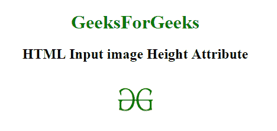

# HTML | `<input>` Height Attribute

> 原文: [https://www.geeksforgeeks.org/html-input-height-attribute/](https://www.geeksforgeeks.org/html-input-height-attribute/)

## HTML `<input>` Height Attribute

The `<input>` height attribute is used to specify the height of an element. This attribute is only used for input type="image".

## Syntax:

```html
<input height="pixels">
```

## Attribute Values:

It contains the value that specifies the height of the input element, i.e., in pixels.

## Example:

```html
<!DOCTYPE html>
<html>

<head>
    <title>
        HTML Input Image height Attribute
    </title>
</head>

<body style="text-align:center;">

<h1 style="color:green;">
            GeeksForGeeks
        </h1>

<h2>HTML Input image Height Attribute</h2>
    <input id="myImage"
           type="image"
           src=
"https://media.geeksforgeeks.org/wp-content/uploads/gfg-40.png"
           alt="Submit"
           width="70"
           height="96" />

</body>

</html>
```

**Output:**


## Supported Browsers:

*   Google Chrome
*   Internet Explorer 10.0 +
*   Firefox Browser
*   Opera
*   Safari
