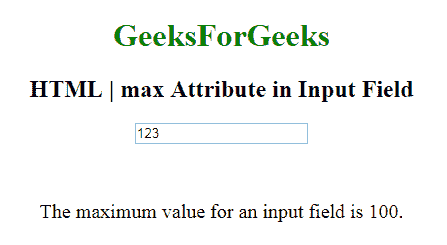

# HTML | `<input>` 最大属性

> 原文: [https://www.geeksforgeeks.org/html-inputmax-attribute/](https://www.geeksforgeeks.org/html-inputmax-attribute/)

**HTML| `<input>` 最大属性**用于指定输入字段的最大值。它可以与 `min` 属性一起使用来创建一个值范围。它可以与许多输入字段一起使用，如数字、范围、日期、日期时间、本地日期时间、月份、时间和星期。

**语法:**

```html
<input max="number|date">
```

**属性值:**

*   **数字:** 包含值，即指定输入字段允许的最大值的数字。
*   **日期:** 包含值，即指定 `<input>` 日期字段允许的最大日期的日期。

**示例:**

```html
<!DOCTYPE html>
<html>

<body style="text-align:center;">

<h1 style="color:green;">
    GeeksForGeeks
</h1>

<h2>
    HTML | `<input>` 最大属性在输入字段中
</h2>
<form id="myGeeks">
    <input type="number"
           id="myNumber"
           step="5"
           name="geeks"
           placeholder="multiples of 5"
           max="100">
</form>
<br>
<br>
<p style="font-size:20px;">
    输入字段的最高值为 100。
</p>
</body>

</html>
```

**输出:**


**支持的浏览器:** `<input>` 最大属性的 **HTML | 支持的浏览器如下:**

*   谷歌 Chrome
*   微软公司出品的 web 浏览器
*   火狐浏览器
*   歌剧
*   旅行队
