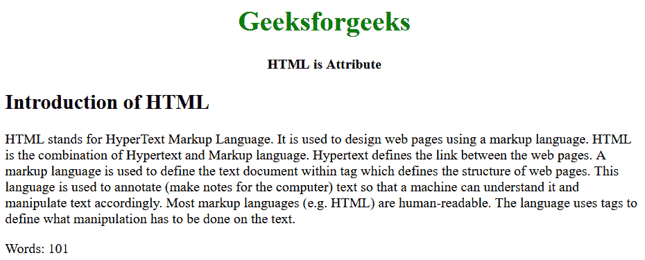

# HTML is Attribute

> 原文: [https://www.geeksforgeeks.org/html-is-attribute/](https://www.geeksforgeeks.org/html-is-attribute/)

HTML "is" is a global attribute that allows you to specify that a standard HTML element should behave like a defined custom built-in element. This means that the attribute can only be used if the specified custom element name is successfully defined in the document.
**Syntax:**

```html
<*tag* is="word-count"></*tag*>
```

Here, `*tag*` can be any HTML tag.**

**Example:** The following example demonstrates how the `is` attribute works in HTML.

## **HyperText Markup Language**

```html
<!DOCTYPE html>
<html>

<body>
    <center>
        <h1 style="color: green">Geeksforgeeks</h1>
        <strong>HTML is Attribute</strong>
    </center>

<article contenteditable="">
        <h2>Introduction of HTML</h2>

<p>
            HTML stands for HyperText Markup Language.
            It is used to design web pages using a markup
            language. HTML is the combination of Hypertext
            and Markup language. Hypertext defines the link
            between the web pages. A markup language is used
            to define the text document within tags which define
            the structure of web pages. This language is used to
            annotate (make notes for the computer) text so that
            a machine can understand it and manipulate text accordingly.
            Most markup languages (e.g., HTML) are human-readable.
            The language uses tags to define what manipulation has
            to be done on the text.
        </p>

<p is="word-count"></p>
    </article>

<script>
    class WordCount extends HTMLParagraphElement {
        constructor() {
            super();

const wcParent = this.parentNode;

function countWords(node) {
                const text = node.innerText || node.textContent;
                return text.split(/\s+/g).length;
            }

const count = `Words: ${countWords(wcParent)}`;

const shadow = this.attachShadow({ mode: 'open' });

const text = document.createElement('span');
                text.textContent = count;

shadow.appendChild(text);
                setInterval(function () {
                    const count = `Words: ${countWords(wcParent)}`;
                    text.textContent = count;
                }, 200);
        }
    }

customElements.define('word-count',
    WordCount, { extends: 'p' });
</script>
</body>

</html>
```

**Output:**



**Supported Browsers:**

*   **Google Chrome**
*   **Firefox Browser**
*   **Safari**
*   **Opera**