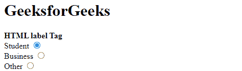
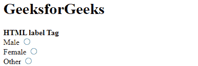

# HTML label 标签

> [HTML 标签](https://www.geeksforgeeks.org/html-label-tag/)

HTML 中的 `<label>` 标签用于为鼠标用户提供可用性改进，即如果用户点击 `<label>` 元素内的文本，它将切换控件。`<label>` 标签定义了 `<button>`、`<input>`、`<meter>`、`<output>`、`<progress>`、`<select>` 或 `<textarea>` 元素的标签。

**使用方式:**

*   首先，通过提供 `<input>` 和 `id` 属性来使用 `<label>` 标签。`<label>` 标签需要一个与输入 `id` 值相同的属性。
*   或者，`<input>` 标签直接在 `<label>` 标签内部使用。在这种情况下，不需要 `for` 和 `id` 属性，因为关联是隐式的。

**语法:**

```html
<label> form content... </label>
```

**属性值:**

*   **for:** 代表这个标签代表的输入控件。其值必须与输入控件的“id”属性的值相同。
*   **form:** 是指标签所属的表单。

**示例 1:** 使用级别标签之外的输入标签。

## 超文本标记语言

```html
<!DOCTYPE html>
<html>
<head>
<title>HTML label Tag Example</title>
</head>
<body>

<h1>GeeksforGeeks</h1>
    <strong>HTML label Tag</strong>

<form>

        <label for="student">
                Student
        </label>
        <input type="radio" name="Occupation"
               id="student" value="student"><br>

        <label for="business">
                Business
        </label>
        <input type="radio" name="Occupation"
               id="business" value="business"><br>

        <label for="other">
                Other
        </label>
        <input type="radio" name="Occupation" 
               id="other" value="other">
    </form>
</body>
</html>
```

**输出:**



**示例 2:** 使用级别标签内部的输入标签。

## 超文本标记语言

```html
<!DOCTYPE html>
<html>
<head>
<title>HTML label Tag Example</title>
</head>
<body>

<h1>GeeksforGeeks</h1>

    <strong>HTML label Tag</strong>

<form>
      <label>
        Male
        <input type="radio" name="gender" 
               id="male" value="male" />
      </label><br/>

      <label>
        Female
        <input type="radio" name="gender" 
               id="female" value="female" /> 
      </label><br/>

      <label>
        Other
        <input type="radio" name="gender" 
               id="other" value="other" />
      </label>
    </form>
</body>
</html>
```

**输出:**



**支持的浏览器:**

*   谷歌 Chrome
*   微软公司出品的 web 浏览器
*   火狐浏览器
*   歌剧
*   旅行队
