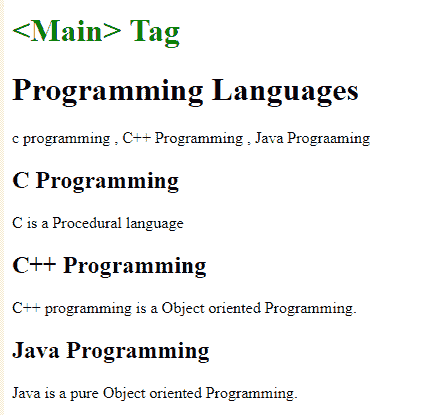

# HTML | main 标签

> 原文: [https://www.geeksforgeeks.org/html-main-tag/](https://www.geeksforgeeks.org/html-main-tag/)

**HTML `<main>` 标签**用于给出文档的主要信息。`<main>` 元素内的内容对于文档来说应该是唯一的。其中包括侧栏、导航链接、版权信息、网站徽标和搜索表单。

**注意:** 文档中不能包含多个 `<main>` 元素。`<main>` 元素不应该是子元素的一个 `<条>`、`<一旁>`、`<页脚>`、`<表头>` 或 `<导航>` 元素。

**语法:**

```html
<main>
    // contents of main Element 
</main>
```

**示例:**

```html
<!DOCTYPE html>
<html>

<head>

<style>
    .class {
        color: green;
    }
</style>
</head>

<body>
    <h1 class="class"><Main> Tag</h1>
    <main>
        <h1>Programming Languages</h1>
        <p>c programming, C++ Programming, Java Programming</p>

        <article>
            <h1>C Programming</h1>
            <p>C is a Procedural language</p>
        </article>

        <article>
            <h1>C++ Programming</h1>
            <p>C++ programming is a Object oriented Programming.</p>
        </article>

        <article>
            <h1>Java Programming</h1>
            <p>Java is a pure Object oriented Programming.</p>
        </article>
    </main>

</body>

</html>
```

**输出:**


**支持的浏览器:** `<main>` 标签支持的浏览器如下:

*   谷歌 Chrome
*   微软公司出品的 web 浏览器
*   火狐浏览器
*   苹果 Safari
*   歌剧
