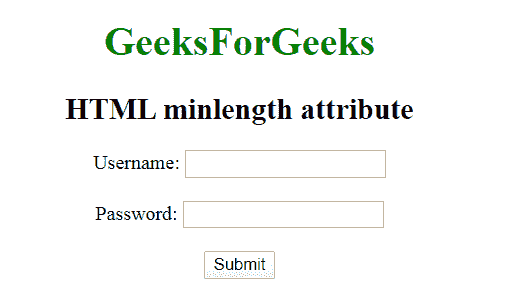

# HTML | 最小长度属性

> 原文: [https://www.geeksforgeeks.org/html-minlength-attribute/](https://www.geeksforgeeks.org/html-minlength-attribute/)

## HTML 最小长度属性

**HTML 最小长度属性**用于指定用户输入到输入字段或文本区域的最小字符数（如 UTF-16 代码）。整数值必须以 0 或更高的值开始。

## 语法

```html
<Element minlength="numeric">
```

## 适用

*   `<input>`
*   `<textarea>`

## 属性值

*   **数字**: 包含数值，即 0 或更高。

## 示例

```html
<!DOCTYPE html>
<html>

<head>
    <title>
        HTML | minlength Attribute
    </title>
</head>

<body style="text-align: center;">

<h1 style="color:green;">
        GeeksForGeeks
    </h1>

<h2>minlength 属性</h2>

<form action="">
        Username:
        <input type="text"
                name="usrname"
                minlength="10">
        <br><br>

Password:
        <input type="text"
                name="password"
                maxlength="10">
        <br><br>

<input type="submit"
                value="Submit">
    </form>
</body>

</html>
```

## 输出



## 支持的浏览器

HTML 最小长度属性支持的浏览器如下：

*   苹果 Safari
*   谷歌 Chrome
*   Firefox
*   歌剧
*   互联网浏览器
