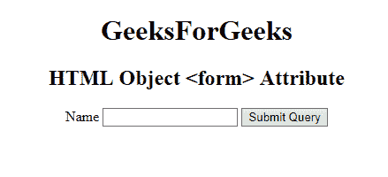

# HTML | object 表单属性

> 原文: [https://www.geeksforgeeks.org/html-object-form-attribute/](https://www.geeksforgeeks.org/html-object-form-attribute/)

**HTML <对象>表单属性**用于指定<对象>元素所属的一个或多个表单。

**语法:**

```html
<object form="form_id">
```

**属性值:**

*   form_id: 它用于指定<对象>元素所属的<form>元素。此属性的值应该是表单元素的id属性。

**示例:**

```html
    <!DOCTYPE html>
    <html>

<body>
        <center>
            <object id="myobject"
                    width="400"
                    height="100"
                    name="myGeeks" 
                    form="myGeeks" 
                    data=
    "https://media.geeksforgeeks.org/wp-content/uploads/geek-8.png">
            </object>

<h1>GeeksForGeeks</h1>
            <h2>HTML Object <form> Attribute</h2>

<form id="myGeeks">
                <label>Name</label>
                <input type="text">
                <input type="submit">
            </form>
        </center>
    </body>

</html>
    ```

**输出:**
    

**支持的浏览器:**没有浏览器支持 *HTML <对象>表单属性*。
