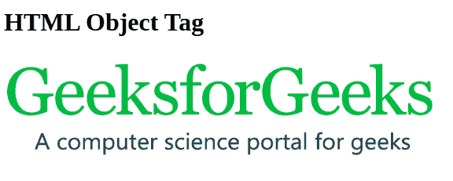

# HTML 对象标签

> 原文: [https://www.geeksforgeeks.org/html-object-tag/](https://www.geeksforgeeks.org/html-object-tag/)

`<object>`标签是一个 HTML 标签，用于在网页中显示音频、视频、图像、PDF 和 Flash 等多媒体。它还可以用于在 HTML 页面中显示另一个网页。参数`<标签>`也与该标签一起用于定义各种参数。在`<对象>`和`</对象>`标签中写入的任何文本都被视为浏览器不支持指定数据时出现的替代文本。这个标签支持 HTML 的所有全局和事件属性。

**例:** `<object>`

## 超文本标记语言

```html
<!DOCTYPE html>

<html>

<body>
        <h1>HTML Object Tag</h1>
        <!--HTML object tag starts here-->
        <object data=
"https://media.geeksforgeeks.org/wp-content/cdn-uploads/Geek_logi_-low_res.png"
width="550px" height="150px">GeeksforGeeks
        <!--HTML object tag ends here-->
        </object>
    </body>

</html>
```

**输出:**



`<object>`标签有以下属性:

<figure class="table">

| 属性 | 值 | 描述 |
| --- | --- | --- |
| [data](https://www.geeksforgeeks.org/html-object-data-attribute/) | 统一资源定位符 | 指定对象中的数据 URL。 |
| [Type](https://www.geeksforgeeks.org/html-object-type-attribute/) | 媒体类型 | 指定在`data`属性中指定的数据的中介类型。 |
| 类型必须匹配 | 布尔 | 表示只有当`type`属性的值与`data`属性提供的资源类型匹配时，才嵌入资源。 |
| [Alignment](https://www.geeksforgeeks.org/html-object-align-attribute/) | Up and down | 定义对象的对齐方式。 |
| [border](https://www.geeksforgeeks.org/html-object-border-attribute/) | 像素 | 指定对象周围的边框。 |
| [Height](https://www.geeksforgeeks.org/html-height-attribute/) | 像素 | 指定对象的高度。 |
| hspace | 像素 | 指定对象左右两侧的空白。 |
| [vspace](https://www.geeksforgeeks.org/html-object-vspace-attribute/) | 像素 | 指定对象上下两侧的空白。 |
| [Height](https://www.geeksforgeeks.org/html-object-height-attribute/) | 像素 | 指定对象的高度。 |
| [Width](https://www.geeksforgeeks.org/html-object-width-attribute/) | 像素 | 指定对象的宽度。 |
| [Name](https://www.geeksforgeeks.org/html-object-name-attribute/) | 名称 | 指定对象的名称。 |
| [Form](https://www.geeksforgeeks.org/html-object-form-attribute/) | 表单 id | 指定对象所属的表单 ID。 |

</figure></object>

**支持的浏览器:**

*   谷歌 Chrome
*   微软公司出品的 web 浏览器
*   火狐浏览器
*   歌剧
*   旅行队
