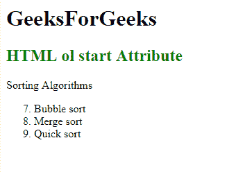

# HTML `<ol>` Start Attribute

> 原文: [https://www.geeksforgeeks.org/html-ol-start-attribute/](https://www.geeksforgeeks.org/html-ol-start-attribute/)

## HTML `<ol>` Start Attribute

The `<ol>` start attribute is used to specify the starting value for numbering individual list items in an ordered list.

## Syntax:

```html
<ol start="number">
```

## Attribute Values:

Contains the numeric value that specifies the starting value for the first list item in the ordered list.

## Example:

This example demonstrates the use of the start attribute within the `<ol>` element.

```html
<!DOCTYPE html>
<html>

<head>
    <title>HTML ol start Attribute</title>
    <style>
        h1,
        h2 {
            text-align: center;
        }
    </style>
</head>

<body>
    <h1>GeeksForGeeks</h1>
    <h2 style="color: green;">
            HTML ol start Attribute
        </h2>

<p>Sorting Algorithms</p>

<ol start="7">
    <li>Bubble sort</li>
    <li>Merge sort</li>
    <li>Quick sort</li>
</ol>
</body>

</html>
```

## Output:


## Supported Browsers:

*   Google Chrome
*   Firefox
*   Edge
*   Opera
*   Apple Safari
