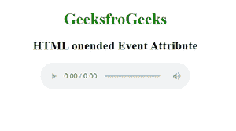
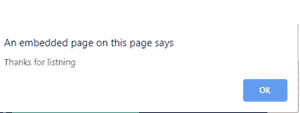

# HTML 统一事件属性

> 原文: [https://www.geeksforgeeks.org/html-onended-event-attribute/](https://www.geeksforgeeks.org/html-onended-event-attribute/)

HTML 的 `onended` 属性是一个事件属性，它在音频/视频结束时触发。我们可以在这个事件中添加一些自定义消息，如“感谢观看”、“分享”等。

**用法:** 此属性用于 `<audio>` 和 `<video>` 元素。

**语法:**

```html
<element onended="myScript">
```

*   **属性值:** 该属性包含单值脚本，当事件属性被调用时执行。

**示例:**

```html
<!DOCTYPE html> 
<html>

<body> 
    <center> 
        <h1 style="color:green">GeeksfroGeeks</h1> 
        <h2>HTML onended Event Attribute</h2> 
        <audio controls onended="gfgFun()"> 
            <source src="beep.mp3" type="audio/mpeg"> 
        </audio>

<script> 
            function gfgFun() { 
                alert("Thanks for listening"); 
            } 
        </script> 
    </center> 
</body>

</html>
```

**输出:**




**支持的浏览器:**

*   谷歌 Chrome
*   微软公司出品的 web 浏览器
*   火狐浏览器
*   苹果 Safari
*   歌剧
