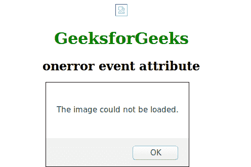

# HTML | onerror 事件属性

> 原文: [https://www.geeksforgeeks.org/html-onerror-event-attribute/](https://www.geeksforgeeks.org/html-onerror-event-attribute/)

当加载外部文件时出现错误时，此属性有效。外部文件可能包含文档文件或图像文件。

## 支持的标签

*   `<input type="image">`
*   `<object>`
*   `<a>`
*   `<script>`

## 语法

```html
<element onerror="script">
```

## 属性值

该属性包含单值脚本，在一个错误事件属性调用时工作。该属性由 ``, `<input type="image">`, `<object>`, `<a>`, `<script>` 标签支持。

## 示例

```html
<!DOCTYPE html>
<html>
    <head>
        <title>onerror event attribute</title>
        <style>
            body {
                text-align:center;
            }
            h1 {
                color:green;
            }
        </style>
    </head>
    <body>
        
        <h1>GeeksforGeeks</h1>
        <h2>onerror event attribute</h2>
        <script>
        function myFunction() {
            alert("The image could not be loaded.");
        }
        </script>
    </body>
</html>
```

## 输出



## 支持的浏览器

以下浏览器支持此属性:

*   Chrome
*   Microsoft Edge
*   Firefox
*   Safari
*   Opera
