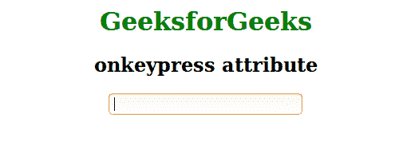
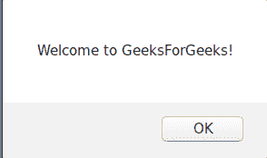

# HTML | onkeypress 属性

> 原文: [https://www.geeksforgeeks.org/html-onkeypress-attribute/](https://www.geeksforgeeks.org/html-onkeypress-attribute/)

当用户按下键盘上的某个键时，此属性会触发。此事件属性不能用于所有浏览器中的所有按键（如 ALT、CTRL、SHIFT、ESC）。

**支持的标签:所有 HTML 元素，除了:**

*   `<iframe></li><li><meta/></li><li><param/></li><li><script/></li><li><style/></li><li><title/></li>`

**语法:**

```html
<pre>&lt;element onkeypress="script"&gt;</pre>
```

**属性:** `onkeypress` 属性适用于所有浏览器中的所有按键。该脚本将在 `keypress` 属性调用时运行。

**注:** 与按键事件相关的事件顺序:

*   叔叔家
*   基普
*   上基乌普

**例:**

```html
<!DOCTYPE html>
<html>
<head>
<title>onkeypress attribute</title>
<style>
body {
    text-align:center;
}
h1 {
    color:green;
}
</style>
</head>
<body>
<h1>GeeksforGeeks</h1>
<h2>onkeypress attribute</h2>
<input type="text" onkeypress="GeeksForGeeks()">
<script>
function GeeksForGeeks() {
    alert("Welcome to GeeksForGeeks!");
}
</script>
</body>
</html>
```

**输出:**

在文本框中点击前:



点击文本框后:



**支持的浏览器:** `onkeypress` 事件属性支持的浏览器如下:

*   谷歌 Chrome
*   微软公司出品的 web 浏览器
*   火狐浏览器
*   歌剧
*   苹果 Safari
</body>
</html>
