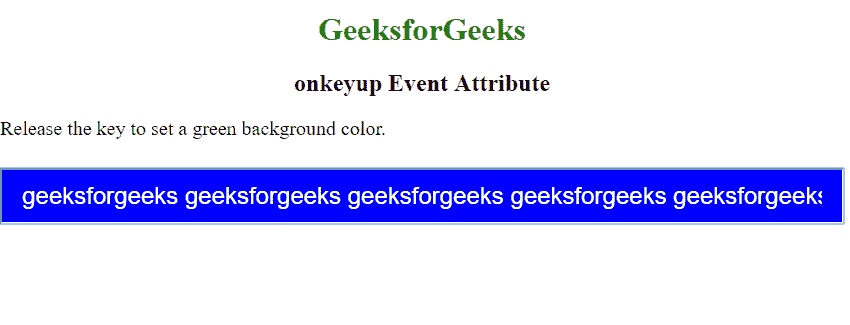
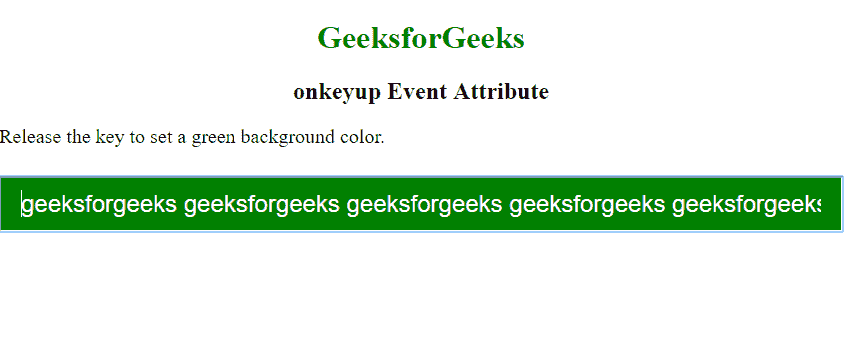

# HTML | onkeyup 事件属性

> 原文: [https://www.geeksforgeeks.org/html-onkeyup-event-attribute/](https://www.geeksforgeeks.org/html-onkeyup-event-attribute/)

当用户从键盘上释放按键时，此 onkeyup 事件属性起作用。
**支持的标签:**支持除以下标签外的所有 HTML 元素：`<base>`, `<bdo>`, `<br>`, `<head>`, `<html>`, `<iframe>`, `<meta>`, `<param>`, `<script>`, `<style>` 和 `<title>`。

*   `<base>`
*   `<bdo>`
*   `<br>`
*   `<head>`
*   `<html>`
*   `<iframe>`
*   `<title>`
*   `<body>`
*   `<stop>`
*   `<script>`
*   `<style>`
*   `<h1>`

**语法:**

```html
<element onkeyup = "script">
```

**属性值:**该属性包含单值 `script`，键盘按键释放时生效。
**支持的标签:**除 `<base>`, `<bdo>`, `<br>`, `<head>`, `<html>`, `<iframe>`, `<meta>`, `<param>`, `<script>`, `<style>` 和 `<title>` 外，其他所有 HTML 元素都支持。
**例:**

## 超文本标记语言

```html
<!DOCTYPE html>
<html>
    <head>
        <title>onkeyup Event Attribute </title>
        <style>
            h1 {
                text-align: center;
                color: green;
            }
            h2 {
                text-align: center;
            }
            input[type=text] {
                width: 100%;
                padding: 12px 20px;
                margin: 8px 0;
                box-sizing: border-box;
                font-size: 24px;
                color: white;
            }
            p {
                font-size: 20px;
            }
        </style>
    </head>
    <body>
        <h1>GeeksforGeeks<h1>
        <h2>onkeyup Event Attribute</h2>

<p>Release the key to set a green background color.</p>

<input type="text" id="demo" onkeydown="keydownFunction()"
                onkeyup="keyupFunction()">
        <script>
            function keydownFunction() {
                document.getElementById("demo").style.backgroundColor = "blue";
            }

function keyupFunction() {
                document.getElementById("demo").style.backgroundColor = "green";
            }
        </script>
    </body>
</html>
```

**输出:**
**按键:**



**释放钥匙:**



**支持的浏览器:**事件属性 `onkeyup` 支持的浏览器如下:

*   Chrome
*   Microsoft Edge
*   Firefox
*   Safari
*   Opera

