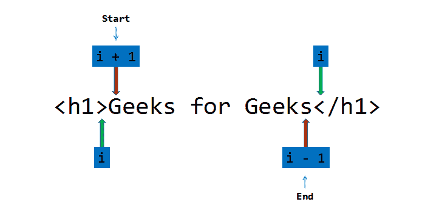

# C/C++中的HTML解析器

> 原文: [https://www.geeksforgeeks.org/html-parser-in-c-cpp/](https://www.geeksforgeeks.org/html-parser-in-c-cpp/)

[HTML解析器](https://www.geeksforgeeks.org/html-parsing-and-processing/) 是一个可以提取有用语句的程序/软件，留下 HTML 标签（如 `<h1>`、`<span>`、`<p>` 等）。

**示例:**

> **输入:** `<h1>极客为极客</h1>`
> **输出:** 极客为极客
> **解释:** `<h1>`和`</h1>`为开、闭标题标签，因此被解析，留下“极客为极客”作为输出。
> 
> **输入:** `<p>Geeks for Geeks</p>`
> **输出:** Geeks for Geeks
> **解释:** `<p>`和`</p>`为开、闭段落标记，因此被解析，解析器忽略空格字符，留下“Geeks for Geeks”作为输出。

**方法:**让输入字符串为大小为 n 的 S，按照以下步骤解决问题:

*   声明两个变量 `start` 和 `end` 指向语句的起点和终点。
*   遍历字符串 S，使用变量 i，如果 S[i] 等于 `>`，则将 `start` 变量更新为 i+1，跳出循环。
*   当 S[start] 等于空格时，通过运行循环从开始处删除空格，并在每次迭代中将 `start` 变量增加 1。
*   再次遍历字符串，S 从开始使用变量 I，如果 S[i] 等于 `<`，更新 `end` 到 i-1，跳出循环。
*   运行一个循环，打印范围 [start, end] 内的字符串。



以下是上述方法在 **C 语言**中的实现:

```html
// C程序用于上述方法

#include <stdbool.h>
#include <stdio.h>
#include <string.h>

// 函数用于解析HTML代码
void parser(char* S)
{
    // 存储输入字符串的长度
    int n = strlen(S);
    int start = 0, end = 0;
    int i, j;

// 遍历字符串
    for (i = 0; i < n; i++) {
        // 如果 S[i] 等于 '>', 更新 start 为 i+1 并跳出循环
        if (S[i] == '>') {
            start = i + 1;
            break;
        }
    }

// 删除空格
    while (S[start] == ' ') {
        start++;
    }

// 再次遍历字符串
    for (i = start; i < n; i++) {
        // 如果 S[i] 等于 '<', 更新 end 为 i-1 并跳出循环
        if (S[i] == '<') {
            end = i - 1;
            break;
        }
    }

// 打印范围 [start, end] 内的字符
    for (j = start; j <= end; j++) {
        printf("%c", S[j]);
    }

printf("\n");
}

// 主函数
int main()
{
    // 给定的输入
    char input1[] = "<h1>This is a statement</h1>";
    char input2[] = "<h1>         This is a statement with some spaces</h1>";
    char input3[] = "<p> This is a statement with some @ #$ ., / special characters</p>         ";

printf("Parsed Statements:\n");

// 函数调用
    parser(input1);
    parser(input2);
    parser(input3);

return 0;
}
```

**输出:**

```html
Parsed Statements:
This is a statement
This is a statement with some spaces
This is a statement with some @ #$ ., / special characters

```

以下是上述方法在 **C++语言**中的实现:

```html
// C++程序用于上述方法
#include <bits/stdc++.h>
using namespace std;

// 函数用于解析HTML代码
void parser(char* S)
{
    // 存储输入字符串的长度
    int n = strlen(S);
    int start = 0, end = 0;

// 遍历字符串
    for (int i = 0; i < n; i++) {
        // 如果 S[i] 等于 '>', 更新 start 为 i+1 并跳出循环
        if (S[i] == '>') {
            start = i + 1;
            break;
        }
    }

// 删除空格
    while (S[start] == ' ') {
        start++;
    }

// 再次遍历字符串
    for (int i = start; i < n; i++) {
        // 如果 S[i] 等于 '<', 更新 end 为 i-1 并跳出循环
        if (S[i] == '<') {
            end = i - 1;
            break;
        }
    }

// 打印范围 [start, end] 内的字符
    for (int j = start; j <= end; j++) {
        cout << S[j];
    }

cout << endl;
}

// 主函数
int main()
{
    // 给定的输入
    char input1[] = "<h1>This is a statement</h1>";
    char input2[] = "<h1>         This is a statement with some spaces</h1>";
    char input3[] = "<p> This is a statement with some @ #$ ., / special characters</p>         ";

cout << "Parsed Statements:\n";

// 函数调用
    parser(input1);
    parser(input2);
    parser(input3);
    return 0;
}
```

**输出:**

```html
Parsed Statements:
This is a statement
This is a statement with some spaces
This is a statement with some @ #$ ., / special characters

```

**时间复杂度:** O(N)
**辅助空间:** O(1)

**注意:** 这个程序一次只解析一条语句。
