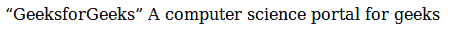

# HTML `<q>` 标签

> 原文: [https://www.geeksforgeeks.org/html-q-tag/](https://www.geeksforgeeks.org/html-q-tag/)

`<q>` 标签是标准报价标签，用于短报价。浏览器通常在引号周围插入一个引号。对于较长的报价，必须使用 `<q>` 标签因为它是块级元素。`<q>` 标签需要起始标签和结束标签。
**语法:**</q>

```html
<q> Contents... </q>
```

**属性**

[**引用**](https://www.geeksforgeeks.org/html-cite-tag/) **:** 包含指定报价来源网址的值，即**网址**。

以下示例说明了 HTML 中的 `<q>` 标签:
**示例 1:**

```html
<html>
    <body>

<p>
          <!-- html q tag is used here -->
          <q>GeeksforGeeks</q>
            A computer science portal for geeks
        </p>

</body>
</html>
```

**输出:**



**示例 2(在 `<q>` 标签中使用 CSS):**

```html
<html>
    <head>
        <title>q tag</title>
        <style>
            q {
                color: #00cc00;
                font-style: italic;
            }
        </style>
    </head>
    <body>

<p>
      <!-- html q tag is used here -->
      <q>GeeksforGeeks</q>
    A computer science portal for geeks
    </p>

</body>
</html>
```

**输出:**


**支持的浏览器:**

*   谷歌 Chrome
*   微软公司出品的 web 浏览器
*   火狐浏览器
*   歌剧
*   旅行队
