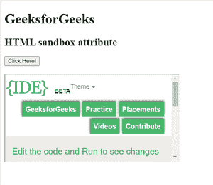

# HTML | 沙盒属性

> 原文: [https://www.geeksforgeeks.org/html-sandbox-attribute/](https://www.geeksforgeeks.org/html-sandbox-attribute/)

**沙盒属性**允许对 iframe 中的内容进行一组额外的限制。当沙盒属性存在时，它将:
**将内容视为来自单一来源:**
- 它阻止表单提交
- 它会阻止脚本执行
- 它禁用了 API
- 它还防止链接瞄准其他浏览上下文
- 它停止内容以导航其顶级浏览上下文
- 阻止自动触发的功能(例如自动播放视频或自动聚焦表单控件)

沙盒属性的值要么是简单的沙盒(然后应用所有限制)，要么是一个用空格分隔的预定义值列表，它将带走实际的限制。
**支持的标签:**
- `<iframe></iframe>`

**属性值:**
- 无值:应用所有限制
- 允许表单:重新启用表单提交
- 允许指针锁定:重新启用应用编程接口
- 允许弹出窗口:重新启用弹出窗口
- 允许相同来源:它允许将 iframe 的内容视为来自相同的来源
- 允许脚本:重新启用脚本
- 允许顶级导航:允许 iframe 的内容导航其顶级浏览内容

**示例:**
```html
<!DOCTYPE html>
<html>
<head>
    <title>HTML sandbox attribute</title>
</head>
<body>
    <h1>GeeksforGeeks</h1>
    <h2>HTML sandbox attribute</h2>
    <button onclick="myGeeks()">Click Here!</button>
    <br>
    <br>
    <iframe id="GFGFrame"
            src="https://ide.geeksforgeeks.org/tryit.php"
            width="400"
            height="200"
            sandbox>
    </iframe>
    <p id="GFG"></p>
    <!-- script to access iframe element -->
    <script>
        function myGeeks() {
            var x = document.getElementById("GFGFrame").src;
            document.getElementById("GFG").innerHTML = x;
        }
    </script>
</body>
</html>
```

**输出:**


**支持的浏览器:**
- 谷歌 Chrome 4.0
- Firefox 17.0
- 苹果 Safari 5.0
- Opera 15.0
- Edge 10.0
