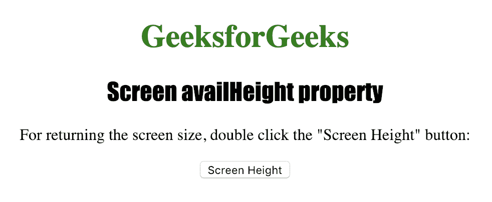
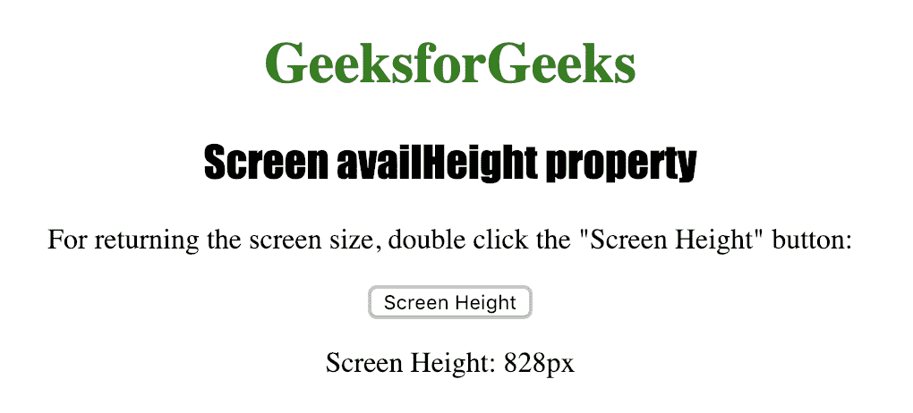

# HTML | 屏幕可用高度属性

> 原文: [https://www.geeksforgeeks.org/html-screen-availheight-property/](https://www.geeksforgeeks.org/html-screen-availheight-property/)

**屏幕可用高度**属性用于返回用户屏幕的高度，以像素为单位。“屏幕可用高度”属性返回的值不包括窗口任务栏等界面功能。
**语法:**

```html
screen.availHeight
```

**返回值:** 返回一个数值，代表用户屏幕的高度，以像素为单位。

下面的程序说明了屏幕可用高度属性：
**获取用户屏幕的高度。**

## 超文本标记语言

```html
<!DOCTYPE html>
<html>

<head>
    <title>
      Screen availHeight property in HTML
    </title>
    <style>
        h1 {
            color: green;
        }

        h2 {
            font-family: Impact;
        }

        body {
            text-align: center;
        }
    </style>
</head>

<body>

<h1>GeeksforGeeks</h1>
    <h2>Screen availHeight property</h2>

<p>
      或返回屏幕大小，双击“屏幕高度”按钮：
    </p>

<button ondblclick="screen_height()">
      屏幕高度
    </button>

<p id="height"></p>

<script>
    function screen_height() {
        var h =
            "屏幕高度: " + screen.availHeight + "px";
        document.getElementById("height").innerHTML = h;
    }
</script>

</body>

</html>
```

**输出:**



**点击**按钮后



**支持的浏览器:** 支持的浏览器包括：

*   谷歌 Chrome
*   微软公司出品的 web 浏览器
*   火狐浏览器
*   歌剧
*   旅行队
