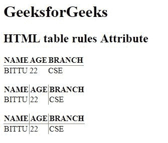

# HTML 表格规则属性

> 原文: [https://www.geeksforgeeks.org/html-table-rules-attribute/](https://www.geeksforgeeks.org/html-table-rules-attribute/)

**HTML `<table>`规则属性**用于指定内部边框哪些部分应该可见。

**语法:**

```html
<table rules="value">
```

**属性值:**

*   **无:** 不创建任何线条。
*   **分组:** 在行组和列组之间创建线。
*   **行:** 在行之间创建一条线。
*   **列:** 在列之间创建一条线。
*   **all:** 在行和列之间创建一条线。

**注意:** HTML 5 不支持 `<table>` 规则属性。

**示例:**

```html
<!DOCTYPE html>
<html>

<head>
    <title>
        HTML 表格规则属性
    </title>
</head>

<body>
    <h1>GeeksforGeeks</h1>

<h2>HTML 表格规则属性</h2>

<table rules="rows">
    <tr>
        <th>NAME</th>
        <th>AGE</th>
        <th>BRANCH</th>
    </tr>
    <tr>
        <td>BITTU</td>
        <td>22</td>
        <td>CSE</td>
    </tr>
</table>
<br>
<table rules="cols">
    <tr>
        <th>NAME</th>
        <th>AGE</th>
        <th>BRANCH</th>
    </tr>
    <tr>
        <td>BITTU</td>
        <td>22</td>
        <td>CSE</td>
    </tr>
</table>
<br>
<table rules="all">
    <tr>
        <th>NAME</th>
        <th>AGE</th>
        <th>BRANCH</th>
    </tr>
    <tr>
        <td>BITTU</td>
        <td>22</td>
        <td>CSE</td>
    </tr>
</table>
</body>

</html>
```

**输出:**


**支持的浏览器:**以下是 **HTML `<table>` 规则属性**支持的浏览器:

*   谷歌 Chrome
*   Internet Explorer 9.0
*   火狐浏览器
*   旅行队
*   歌剧
