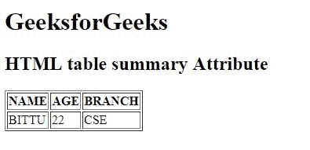

# HTML 表格汇总属性

> 原文: [https://www.geeksforgeeks.org/html-table-summary-attribute/](https://www.geeksforgeeks.org/html-table-summary-attribute/)

**HTML `<table>` 汇总属性**用于指定表格内容的汇总。

**语法:**

```html
<table summary="text">
```

**属性值:**

*   **文字:** 保存表格内容的摘要。

**注意:** HTML 5 不支持 `<table>` 汇总属性。

**示例:**

```html
<!DOCTYPE html>
<html>

<head>
    <title>
        HTML table summary Attribute
    </title>
</head>

<body>
    <h1>GeeksforGeeks</h1>

<h2>HTML table summary Attribute</h2>

<table border="1" summary="It describes the author details.">
    <tr>
        <th>NAME</th>
        <th>AGE</th>
        <th>BRANCH</th>
    </tr>
    <tr>
        <td>BITTU</td>
        <td>22</td>
        <td>CSE</td>
    </tr>
</table>
</body>

</html>
```

**输出:**


**支持的浏览器:** 支持的浏览器如下:

*   谷歌 Chrome
*   微软公司出品的 web 浏览器
*   火狐浏览器
*   旅行队
*   歌剧
