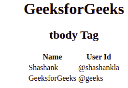

# HTML `<tbody>` 标签

> [HTML `<tbody>` 标签](https://www.geeksforgeeks.org/html-tbody-tag/)

HTML 中的 `<tbody>` 标签用于制作一组相同类型的正文元素内容。这个标签用在带有页眉和页脚的 HTML 表格中，这就是所谓的“标题”和“页脚”。`<tbody>` 标签是 `<table>` 标签的子标签，和 `<thead>` 标签是 `<table>` 标签的父标签。

**Syntax:**

```html
<tbody> // Table contents   </tbody>
```

**属性:** HTML 4.1 中 `<tbody>` 标签支持部分属性，HTML5 中不支持。属性列表如下:

*   **align**: 设置内容的对齐方式。
*   **valign**: 设置内容的垂直对齐方式。
*   **char**: 将 `<tbody>` 和 `</tbody>` 标签内的内容对齐设置为一个字符。
*   **charoff**: 用于将字符设置为与 `char` 属性指定的字符对齐的 `<tbody>` 和 `</tbody>` 标签内的内容。

******例:******

## 超文本标记语言

```html
**<!DOCTYPE html>
<html>

<body>
        <center>
        <h1>GeeksforGeeks</h1>
        <h2>tbody Tag</h2>
        <table>
            <thead>
                <tr>
                    <th>Name</th>
                    <th>User Id</th>
                </tr>
            </thead>

<!-- tbody tag starts from here -->
            <tbody>
                <tr>
                    <td>Shashank</td>
                    <td>@shashankla</td>
                </tr>
                    <tr>
                    <td>GeeksforGeeks</td>
                    <td>@geeks</td>
                </tr>
            </tbody>
            <!-- tbody tag ends here -->

</table>
        </center>
    </body>

</html>                   **
```

******输出:******



******支持的浏览器:******

*   谷歌 Chrome
*   微软公司出品的 web 浏览器
*   火狐浏览器
*   歌剧
*   旅行队
