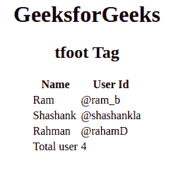

# HTML tfoot Tag

> [HTML tfoot Tag](https://www.geeksforgeeks.org/html-tfoot-attribute/)

HTML 中的 `<tfoot>` 标签用来给页脚组内容。这个标签用在带有标题和正文的 HTML 表格中，称为“标题”和“正文”。`<tfoot>` 标签是 `<table>` 标签的子标签，和 `<thead>` 标签一起使用。

## 超文本标记语言

```html
<!DOCTYPE html>
<html>

<body>
        <center>
        <h1>GeeksforGeeks</h1>
        <h2>tfoot Tag</h2>
        <table >
            <thead>
                <tr>
                    <th>Name</th>
                    <th>User Id</th>
                </tr>
            </thead>
            <tbody>
                <tr>
                    <td>Ram</td>
                    <td>@ram_b</td>
                </tr>
                <tr>
                    <td>Shashank</td>
                    <td>@shashankla</td>
                </tr>
                <tr>
                    <td>Rahman</td>
                    <td>@rahamD</td>
                </tr>
            </tbody>

<!-- tfoot tag starts from here -->
            <tfoot>
                <tr>
                    <td>Total user</td>
                    <td>4</td>
                </tr>
            </tfoot>
            <!-- tfoot tag ends here -->

</table>
        </center>
    </body>

</html>
```

**输出:**



**支持的浏览器:**

*   谷歌 Chrome
*   微软公司出品的 web 浏览器
*   火狐浏览器
*   旅行队
*   歌剧
