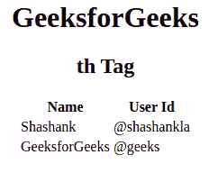

# HTML 第十个标签

> [原文](https://www.geeksforgeeks.org/html-th-tag/)

HTML 中的`<th>`标签用于设置表格的标题单元格。HTML 表格中有两种类型的单元格：

*   **表头单元格**：用于保存表头信息。
*   **标准单元格**：用于保存数据体。

`<th>`和`<td>`标签工作方式相同，但文本属性不同。`<th>`标签中的文本默认居中并加粗，而`<td>`标签中的文本默认左对齐。

**语法：**

```html
<th> Contents... </th>
```

**属性：**HTML 4.1 支持许多属性，但从 HTML5 中删除了一些属性：

*   **缩写**：该属性用作标题单元格中文本内容的缩写。
*   **对齐**：设置文字内容的对齐方式。
*   **轴**：类别表头单元格。
*   **背景色**：设置表头单元格的背景色。
*   **字符**：将标题单元格中的内容与字符对齐。
*   **charoff**：用于设置从 char 属性指定的字符开始对齐的字符数。
*   **列跨度**：标题单元格应跨度的列数。
*   **标题**：指定一个单元格相关的一个或多个标题单元格。
*   **高度**：设置表头单元格的高度。
*   **nowrap**：它指定标题单元格内的内容不应换行。
*   **行跨度**：设置标题单元格应跨度的行数。
*   **范围**：用于指定表头内容的分值。
*   **排序**：用于对一列的方向进行排序。
*   **垂直对齐**：用于设置文字内容的垂直对齐方式。
*   **宽度**：用于设置表头单元格的宽度。

**示例：**

```html
<!DOCTYPE html>
<html>
    <body>
        <center>
        <h1>GeeksforGeeks</h1>
        <h2>th Tag</h2>
        <table>
            <thead>
                <tr>
                    <!-- th tag starts here -->
                    <th>Name</th>
                    <th>User Id</th>
                    <!-- th tag end here -->
                </tr>
            </thead>
            <tbody>
                <tr>
                    <td>Shashank</td>
                    <td>@shashankla</td>
                </tr>
                    <tr>
                    <td>GeeksforGeeks</td>
                    <td>@geeks</td>
                </tr>
            </tbody>
        </table>
        </center>
    </body>
</html>
```

**输出：**



**支持的浏览器：**

*   谷歌 Chrome
*   边缘
*   火狐浏览器
*   旅行队
*   歌剧
