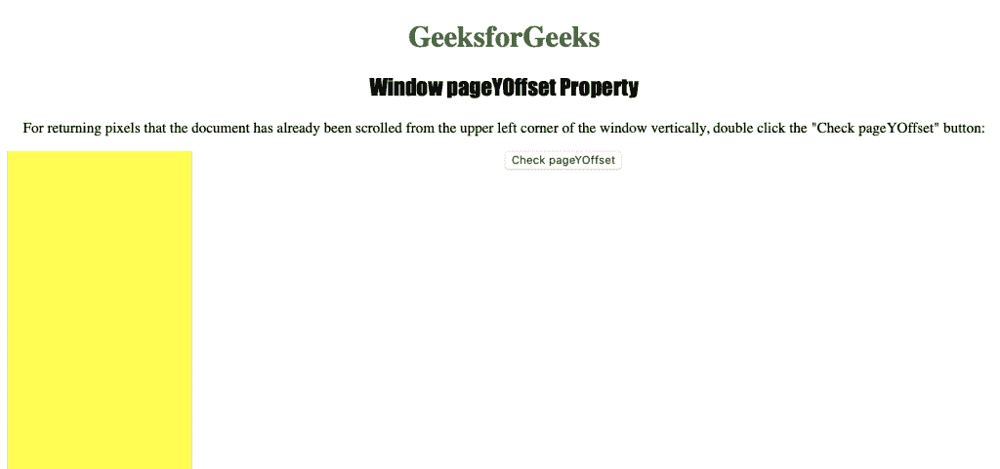
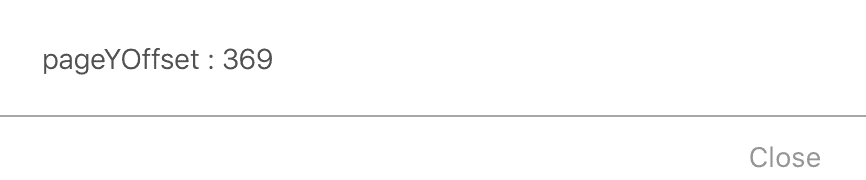

# HTML | Window PageYOffset Property

> 原文: [https://www.geeksforgeeks.org/html-window-pageyoffset-property/](https://www.geeksforgeeks.org/html-window-pageyoffset-property/)

**Window PageYOffset Property** is used to return the number of pixels that the document has been scrolled vertically from the upper left corner of the window. This is a read-only property that returns a number representing the number of pixels the document has been scrolled vertically from the upper left corner of the window.

**Syntax:**

```html
window.pageYOffset
```

The following program demonstrates the Window PageYOffset Property:

**Get the number of pixels the document has been scrolled vertically from the upper left corner of the window.**

```html
<!DOCTYPE html>
<html>

<head>
    <title>
      Window pageYOffset Property in HTML
    </title>
    <style>
        h1 {
            color: green;
        }

h2 {
            font-family: Impact;
        }

body {
            text-align: center;
        }

div {
            border: 2px black;
            background-color: yellow;
            height: 2000px;
            width: 200px;
        }
    </style>
</head>

<body>

<h1>GeeksforGeeks</h1>
    <h2>Window pageYOffset Property</h2>

<p>
      For returning pixels that the document has already
      been scrolled from the upper left corner of the 
      window vertically, double click the "Check 
      pageYOffset" button: 
    </p>

<button ondblclick="offset()" >
        Check pageYOffset
    </button>

<div>
    </div>

<script>
        function offset() {
            window.scrollBy(100, 100);
            alert("pageYOffset : " + window.pageYOffset);
        }
    </script>

</body>

</html>
```

**Output:**


**Click**

button after

**Supported Browsers:** The Window PageYOffset Property is supported by the following browsers:

*   Google Chrome
*   Microsoft Edge
*   Firefox
*   Opera
*   Safari
