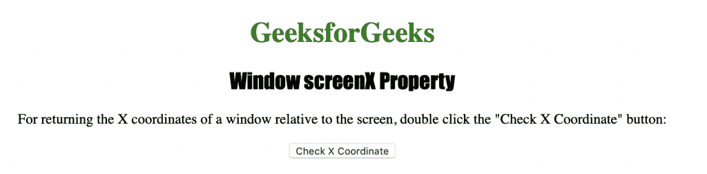
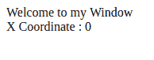

# HTML | Window Screen X Property

> 原文: [https://www.geeksforgeeks.org/html-window-screenx-property/](https://www.geeksforgeeks.org/html-window-screenx-property/)

**Window Screen X Property** is used to return the "x" or horizontal coordinate of the window relative to the screen. It returns a number representing the horizontal distance of the window from the screen in pixels.
**Syntax:**

```html
window.screenX
```

**Return Value:** Returns a number representing the horizontal distance of the window from the screen in pixels.

The following program demonstrates the `window.screenX` property:
**Check Window Relative X Coordinate.**

## HyperText Markup Language

```html
<!DOCTYPE html>
<html>

<head>
    <title>
      Window screenX Property in HTML
    </title>
    <style>
        h1 {
            color: green;
        }

h2 {
            font-family: Impact;
        }

body {
            text-align: center;
        }
    </style>
</head>

<body>

<h1>GeeksforGeeks</h1>
    <h2>Window screenX Property</h2>

<p>
      For returning the X coordinates of a window
      relative to the screen, double click the
      "Check X Coordinate" button:
    </p>

<button ondblclick="coordinate()">
      Check X Coordinate
    </button>

<script>
        function coordinate() {
            var x = window.open("", "myWindow");
            x.document.write
                    ("
<p>Welcome to my Window");
            x.document.write
            ("<br> X Coordinate : " + x.screenX + "</p>
");
        }
    </script>

</body>

</html>
```

**Output:**



**After Clicking** the button



**Supported Browsers:** The `window.screenX` property is supported by the following browsers:

*   Google Chrome
*   Microsoft Edge
*   Firefox
*   Opera
*   Safari
