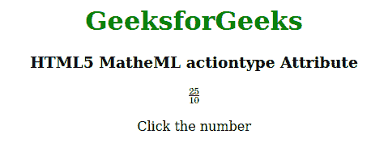

# HTML5 MathML Action Type Attribute

> 原文: [https://www.geeksforgeeks.org/html5-mathml-actiontype-attribute/](https://www.geeksforgeeks.org/html5-mathml-actiontype-attribute/)

The `actiontype` attribute contains three types of actions: **status**, **toggle**, and **tooltip**, each with different behaviors. This attribute is accepted only by the `<maction>` tag.

## Syntax:

```html
<element accentunder="statusline|toggle|tooltip">
```

## Attribute Values:

*   **Status Line:** This attribute displays the computed value through a status line.
*   **Toggle:** This attribute toggles the computed value.
*   **Tooltip:** This attribute pops up the computed value.

The following example demonstrates the `actiontype` attribute in HTML5:

## HyperText Markup Language

```html
<!DOCTYPE html>
<html>

<head>
    <title>HTML5 actiontype Attribute</title>
</head>

<body>
    <center>
        <h1 style="color:green">GeeksforGeeks</h1>
        <h3>HTML5 MatheML actiontype Attribute</h3>
        <math>
            <maction actiontype="toggle">
                <mfrac>
                    <mn>25</mn>
                    <mn>10</mn>
                </mfrac>
                <mfrac>
                    <mrow>
                        <mn>5</mn>
                        <mo>⋅</mo>
                        <mn>5</mn>
                    </mrow>
                    <mrow>
                        <mn>2</mn>
                        <mo>⋅</mo>
                        <mn>5</mn>
                    </mrow>
                </mfrac>
                <mfrac>
                    <mn>5</mn>
                    <mn>2</mn>
                </mfrac>
            </maction>
        </math>
        <p>Click the number</p>
    </center>
</body>

</html>
```

**Output:**



**Supported Browsers:** The HTML 5 MathML `actiontype` attribute is supported by the following browsers:

*   Firefox Browser
