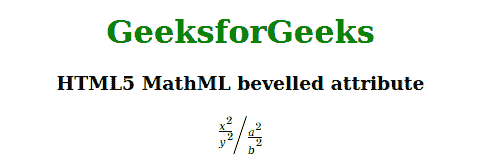

# HTML5 MathML 斜切属性

> 原文: [https://www.geeksforgeeks.org/html5-mathml-bevelled-attribute/](https://www.geeksforgeeks.org/html5-mathml-bevelled-attribute/)

该属性保存显示任何分数的值。如果值为`true`，则分子和分母并排显示，并用斜线隔开。如果值为`false`（默认值），则显示的分子和分母在彼此之上。该属性是接受 `<mfrac>` 标签。

## 语法:

```html
<element bevelled="true|false">
```

## 属性值:

*   **true:** 如果值为`true`，则分子和分母并排显示，并用斜线隔开。
*   **false:** 如果值为`false`（默认值），则显示的分子和分母相互叠加。

## 示例:

下面的示例说明了 HTML5 MathML 中的*斜切*属性。

## 超文本标记语言

```html
<!DOCTYPE html> 
<html>

<body> 
    <center> 
        <h1 style="color:green"> 
            GeeksforGeeks 
        </h1>

<h3>HTML5 MathML bevelled attribute</h3>

<math> 
            <mfrac bevelled="true"> 
                <mfrac> 
                    <msup> 
                        <mi>x</mi> 
                        <mn>2</mn> 
                    </msup> 
                    <msup> 
                        <mi>y</mi> 
                        <mn>2</mn> 
                    </msup> 
                </mfrac> 
                <mfrac> 
                    <msup> 
                        <mi>a</mi> 
                        <mn>2</mn> 
                    </msup> 
                    <msup> 
                        <mi>b</mi> 
                        <mn>2</mn> 
                    </msup> 
                </mfrac> 
            </mfrac> 
        </math> 
    </center> 
</body> 
</html> 
```

**输出:**



**支持的浏览器:** HTML 5 MathML *斜切*属性支持的浏览器如下。

*   火狐浏览器
