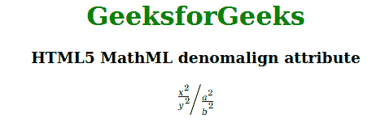

# HTML5 MathML Denomalign Attribute

> 原文: [https://www.geeksforgeeks.org/html5-mathml-denomalli-attribute/](https://www.geeksforgeeks.org/html5-mathml-denomalli-attribute/)

The `denomalign` attribute stores the alignment value for the denominator, with possible values being left, center, or right. This attribute is accepted only by the `<mfrac>` tag.

**Syntax:**

```html
<element denomalign="left|right|center">
```

**Attribute Values:**

*   **Left:** This attribute sets the alignment of the denominator context to the left for each line.
*   **Right:** This attribute sets the alignment of the denominator context to the right for each line.
*   **Center:** This attribute sets the alignment of the denominator context to the center for each line.

The following example illustrates the `denomalign` attribute in HTML5 MathML:

**Example:**

## 超文本标记语言

```html
<!DOCTYPE html> 
<html>

<head> 
    <title>HTML5 MathML denomalign attribute</title> 
</head>

<body> 
    <center> 
        <h1 style="color:green"> 
            GeeksforGeeks 
        </h1>

<h3>HTML5 MathML denomalign attribute</h3>

<math> 
            <mfrac bevelled="true" denomalign="left" > 
                <mfrac> 
                    <msup> 
                        <mi>x</mi> 
                        <mn>2</mn> 
                    </msup> 
                    <msup> 
                        <mi>y</mi> 
                        <mn>2</mn> 
                    </msup> 
                </mfrac> 
                <mfrac> 
                    <msup> 
                        <mi>a</mi> 
                        <mn>2</mn> 
                    </msup> 
                    <msup> 
                        <mi>b</mi> 
                        <mn>2</mn> 
                    </msup> 
                </mfrac> 
            </mfrac> 
        </math> 
    </center> 
</body>

</html>
```

**Output:**



**Supported Browsers:** The browsers that support the `denomalign` attribute in HTML5 MathML are as follows:

*   Firefox browser
