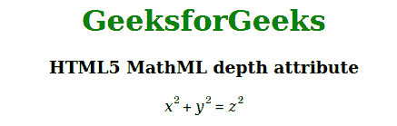

# HTML5 MathML Depth Attribute

> 原文: [https://www.geeksforgeeks.org/html5-mathml-depth-attribute/](https://www.geeksforgeeks.org/html5-mathml-depth-attribute/)

The `depth` attribute is used to set the depth or increase/decrease the depth of the content. This attribute is accepted only by the `<mpadded>` tag.

**Syntax:**

```html
<element depth="length">
```

**Attribute Values:**

*   **Length:** This attribute sets or increases the depth.

The following example illustrates the `depth` attribute in HTML5 MathML:

**Example:**

## 超文本标记语言

```html
<!DOCTYPE html> 
<html>

<head> 
    <title>HTML5 MathML depth attribute</title> 
</head>

<body style="text-align:center;">

<h1 style="color:green"> 
        GeeksforGeeks 
    </h1>

<h3>HTML5 MathML depth attribute</h3>

<math> 
        <mpadded depth="20"> 
            <mrow> 
                <mrow> 
                    <msup> 
                        <mi>x</mi> 
                        <mn>2</mn> 
                    </msup> 
                    <mo>+</mo> 
                    <msup> 
                        <mi>y</mi> 
                        <mn>2</mn> 
                    </msup> 
                </mrow> 
                <mo>=</mo> 
                <msup> 
                    <mi>z</mi> 
                    <mn>2</mn> 
                </msup> 
            </mrow> 
        </mpadded> 
    </math> 
</body>

</html>
```

**Output:**



**Supported Browsers:** The HTML5 MathML `depth` attribute is supported by the following browsers:

*   Firefox browser
