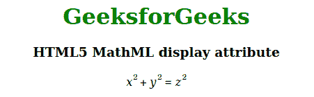

# HTML5 MathML Display Attribute

> 原文: [https://www.geeksforgeeks.org/html5-mathml-display-attribute/](https://www.geeksforgeeks.org/html5-mathml-display-attribute/)

This attribute preserves the value of the HTML element. It can have two values, block, which means the element will be displayed outside the current text range, and inline, which means the element will be displayed within the current text range. This attribute is only accepted by the `<math>` tag.

**Syntax:**

```html
<element display="block|inline">
```

**Attribute Values:**

*   **Block:** This value defines that the element will be displayed outside the current text range.
*   **Inline:** This value defines that the element will be displayed within the current text range.

The following example illustrates the display attribute of HTML5 MathML:

**Example:**

## 超文本标记语言

```html
<!DOCTYPE html> 
<html>

<head> 
    <title>HTML5 MathML display attribute</title> 
</head>

<body> 
    <center> 
        <h1 style="color:green"> 
            GeeksforGeeks 
        </h1>

<h3>HTML5 MathML display attribute</h3>

<math display="block"> 
            <mrow> 
                <mrow> 
                    <msup> 
                        <mi>x</mi> 
                        <mn>2</mn> 
                    </msup> 
                    <mo>+</mo> 
                    <msup> 
                        <mi>y</mi> 
                        <mn>2</mn> 
                    </msup> 
                </mrow> 
                <mo>=</mo> 
                <msup> 
                    <mi>z</mi> 
                    <mn>2</mn> 
                </msup> 
            </mrow> 
        </math> 
    </center> 
</body>

</html>
```

**Output:**



**Supported Browsers:** The display attribute is supported by the following browsers:

*   Firefox Browser
