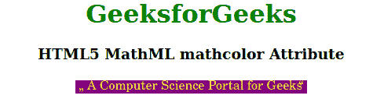

# HTML5 MathML mathcolor 属性

> 原文: [https://www.geeksforgeeks.org/html5-mathml-mathcolor-attribute/](https://www.geeksforgeeks.org/html5-mathml-mathcolor-attribute/)

HTML5 中的 `mathcolor` 属性用于指定数学表达式中使用的前景色。颜色可以以任何形式定义，可以是 RGB 或任何字符串颜色名称。所有的 MathML 标签都接受这个属性。

## 语法

```html
<element mathcolor="colorname">
```

## 属性值

该属性具有如上所述的单一值，如下所述:

*   **colorname:** 它是定义用于 MathML 标记的颜色的值。

## 示例

```html
<!DOCTYPE html>
<html>

<body style="text-align:center;">
    <h1 style="color:green">
        GeeksforGeeks
    </h1>

<h3>HTML5 MathML mathcolor Attribute</h3>

<math>
        <ms lquote="„" rquote=" “" 
            mathcolor="Yellow" mathbackground="Purple">
            A Computer Science Portal for Geeks
        </ms>
    </math>
</body>

</html>
```

## 输出



## 支持的浏览器

`mathcolor` 属性支持的浏览器如下:

*   火狐浏览器
