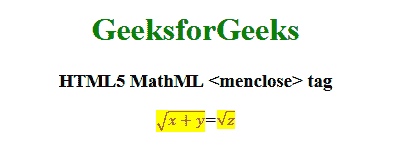

# HTML5 MathML `<menclose>` 标签

> 原文: [https://www.geeksforgeeks.org/html5-mathml-menclose-tag/](https://www.geeksforgeeks.org/html5-mathml-menclose-tag/)

**HTML5 MathML `<menclose>` 标签** 是 HTML5 中的一个内置元素。它用于呈现符号属性指定的封闭符号内部的内容。
**语法:**

```html
<menclose attribute="value"> child elements </menclose>
```

**属性:** 标签接受以下列出的一些属性:

*   **class| id| style:** 该属性用于保存子元素的样式。
*   **href:** 该属性用于保存任何指向指定网址的超链接。
*   **mathbackground:** 该属性保存数学表达式背景颜色的值。
*   **mathcolor:** 该属性保存数学表达式的颜色。
*   **notation:** 该属性保存符号，每个符号都像其他符号不存在一样绘制，一次使用多个符号会出现符号重叠。可能的值有**fence**、**bottom**、**box**、**circle**、**ldash**、**left**、**lbrack**、**lceil**、**lmoust**、**phabs**、**none**、**overbar**、**plus**、**right**、**rbrack**、**rcurl**、**rceil**、**round**。

以下示例将说明 **HTML5 MathML `<menclose>`** 的概念标签:
**示例:**

```html
<!DOCTYPE html>
<html>

<head>
    <title>HTML5 MathML menclose tag</title>
</head>

<body style="text-align:center;">

<h1 style="color:green">GeeksforGeeks</h1>

<h3>HTML5 MathML <menclose> tag</h3>

<math>
    <math>
        <menclose notation="radical"
                mathbackground="yellow"
                mathcolor="purple">
            <mrow>
                <mi> x </mi>
                <mo> + </mo>
                <mi> y </mi>
            </mrow>
        </menclose>
        <mi>=</mi>
        <menclose notation="radical"
                mathbackground="yellow"
                mathcolor="purple">
            <mi>z</mi>
        </menclose>
    </math>
</math>
</body>

</html>
```

**输出:**



**支持的浏览器:** 支持的浏览器有 **HTML5 MathML `<menclose>`** 标签如下:

*   Firefox
*   Safari
