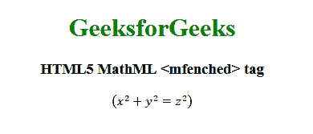

# HTML5 | MathML `<mfenced>` 标签

> 原文: [https://www.geeksforgeeks.org/html5-mathml-mfenched-tag/](https://www.geeksforgeeks.org/html5-mathml-mfenched-tag/)

HTML5 中的 MathML `<mfenced>` 标签用于添加自定义的开括号和闭括号。像你可以打开任何圆括号，可以关闭不同的括号和分隔符。

**语法:**

```html
<mfenced open="parentheses" close="parentheses" separators=" ">
    child elements
</mfenced>
```

**属性:**该标签接受以下列出的一些属性:

*   **class|id|style:** 该属性用于保存子元素的样式。
*   **href:** 此属性用于保存任何指向指定 URL 的超链接。
*   **mathbackground:** 该属性保存数学表达式背景颜色的值。
*   **mathcolor:** 该属性保存数学表达式的颜色。
*   **open:** 该属性保存左括号。
*   **separators:** 该属性保存每个字符串或任何想要从任何内容中分离出来的内容的分隔符。
*   **close:** 该属性保存右括号。

下面的例子说明了 HTML5 中的 MathML `<mfenced>` 标签:

**示例:**

```html
<!DOCTYPE html>
<html>

<head>
    <title>HTML5 MathML <mfenced> tag</title>
</head>

<body>
    <center>
        <h1 style="color:green">
            GeeksforGeeks
        </h1>

<h3>HTML5 MathML <mfenced> tag</h3>

<math>
            <mfenced open="(" close=")" separators="">
                <mrow>
                    <msup>
                        <mi>x</mi>
                        <mn>2</mn>
                    </msup>
                    <mo>+</mo>
                    <msup>
                        <mi>y</mi>
                        <mn>2</mn>
                    </msup>
                    <mo>=</mo>
                    <msup>
                        <mi>z</mi>
                        <mn>2</mn>
                    </msup>
                </mrow>
            </mfenced>
        </math>
    </center>
</body>

</html>
```

**输出:**



**支持的浏览器:** HTML 5 MathML `<mfenced>` 标签支持的浏览器如下:

*   火狐浏览器
