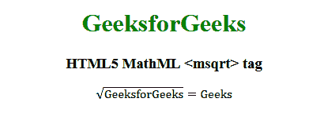

# HTML5 | MathML `<msqrt>` 标签

> [吴奇珍](https://www.geeksforgeeks.org/html-5-mathml-msqrt-标签/)

HTML5 中的 **MathML `<msqrt>` 标签**用于显示元素内容的根平方。

## 语法

```html
<msqrt> Element contents </msqrt>
```

## 属性

该标签接受以下列出的一些属性:

*   **class|id|style:** 该属性用于保存子元素的样式。
*   **mathbackground:** 该属性保存数学表达式背景颜色的值。
*   **href:** 该属性用于保存任何指向指定网址的超链接。
*   **mathcolor:** 该属性保存数学表达式的颜色。

## 例子

```html
<!DOCTYPE html>
<html>

<head>
    <title>HTML5 MathML `<msqrt>` tag</title>
</head>

<body style="text-align:center;">

<h1 style="color:green">GeeksforGeeks</h1>

<h3>HTML5 MathML `<msqrt>` tag</h3>

<math>
        <msqrt>
            <mi>GeeksforGeeks</mi>
        </msqrt>
        <mo>=</mo>
        <mtext>Geeks</mtext>
    </math>
</body>

</html>
```

## 输出



## 支持的浏览器

支持的浏览器有 **HTML5 MathML `<msqrt>`** 标签如下:

*   火狐浏览器
*   猎豹浏览器
