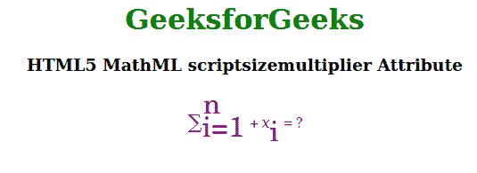

# HTML 5 MathML scriptSize Multiplier Attribute

> 原文: [https://www.geeksforgeeks.org/html5-mathml-scriptsizemultiplier-attribute/](https://www.geeksforgeeks.org/html5-mathml-scriptsizemultiplier-attribute/)

The **MathML scriptSize multiplier** attribute in HTML5 is used to specify the multiplier for adjusting the font size due to changes in *scriptlevel*. The default value of this attribute is 0.71. This attribute is accepted only by the `<mstyle>` tag.

**Syntax:**

```html
<element scriptsizemultiplier="number">
```

**Attribute Values:** This attribute has a single value as described above:

*   **Number:** This value is used to specify the multiplier for adjusting the font size due to changes in scriptlevel.

The following example illustrates the **MathML scriptSize multiplier** attribute:

**Example:**

## 超文本标记语言

```html
<!DOCTYPE html>
<html>

<body>
    <center>
        <h1 style="color:green">
            GeeksforGeeks
        </h1>

<h3>
            HTML5 MathML scriptSize Multiplier
            Attribute
        </h3>

<math>
            <mstyle displaystyle="true"
                mathcolor="purple" scriptlevel="0" 
                scriptsizemultiplier="2">

<mrow>
                    <msubsup>
                        <mo>∑</mo>
                        <mn> i=1 </mn>
                        <mn> n </mn>
                    </msubsup>
                    <mo>+</mo>
                    <msub>
                        <mi>x</mi>
                        <mn>i</mn>
                    </msub>
                    <mo>=</mo>
                    <mn>?</mn>
                </mrow>
            </mstyle>
        </math>
    </center>
</body>

</html>
```

**Output:**



**Supported Browsers:** The following lists the browsers that support the **html 5 MathML scriptSize multiplier** attribute:

*   Firefox Browser
