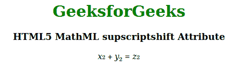

# HTML5 MathML supscriptshift 属性

> 原文: [https://www.geeksforgeeks.org/html5-mathml-supscriptshift-attribute/](https://www.geeksforgeeks.org/html5-mathml-supscriptshift-attribute/)

该属性定义了将上标移到表达式基线以下的最小空间。该属性被 `<mmultiscripts>`, `<msub>` 和 `<msubup>` 标签接受。

## 语法

```html
<element supscriptshift="length">
```

## 属性值

*   **长度:** 该属性保存特定单位的数字，该数字将在基线以下的 supscriptshift 上移动。

## 示例

```html
<!DOCTYPE html>
<html>

<head>
    <title>
        HTML5 MathML supscriptshift Attribute
    </title>
</head>

<body>
    <center>
        <h1 style="color:green">
            GeeksforGeeks
        </h1>

<h3>
            HTML5 MathML supscriptshift Attribute
        </h3>

<math>
    <mfenced>
        <mrow>
            <msub supscriptshift="5px">
                <mi>x</mi>
                <mn>2</mn>
            </msub>
            <mo>+</mo>
            <msub supscriptshift="5px">
                <mi>y</mi>
                <mn>2</mn>
            </msub>
            <mo>=</mo>
            <msub supscriptshift="5px">
                <mi>z</mi>
                <mn>2</mn>
            </msub>
        </mrow>
    </mfenced>
</math>
    </center>
</body>

</html>
```

**输出:**



**支持的浏览器:** 支持的浏览器包括:

*   火狐浏览器
