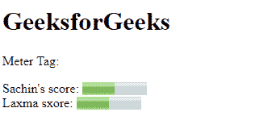

# HTML5 `<meter>` 标签

> 原文: [https://www.geeksforgeeks.org/html5-meter-tag/](https://www.geeksforgeeks.org/html5-meter-tag/)

它用于在明确定义的范围内定义测量刻度，还支持小数值。它也被称为标尺。它用于磁盘使用、相关性查询结果等。

## 语法

```html
<meter attributes...> </meter>
```

## 属性

该标签包含许多属性，如下所示:

*   **`form`**: 它也定义了仪表标签所属的一个或多个表单。
*   **`max`**: 用于指定一个范围的最大值。
*   **`min`**: 用于指定一个范围的最小值。
*   **`high`**: 用于指定被认为是高值的范围。
*   **`low`**: 用于指定被认为是低的范围值。
*   **`optimum`**: 用于指定区间的最优值。
*   **`value`**: 用于指定范围的要求值或实际值。

## 示例

## 超文本标记语言

```html
<!DOCTYPE html>
<html>
    <body>
        <h1>GeeksforGeeks</h1>

<p>Meter Tag:</p>

Sachin's score:
        <meter value="5" min="0" max="10">
          5 out of 10
        </meter>
        <br>
        Laxma sxore:
        <meter value="0.5">
          50% from 100%
        </meter>
    </body>
</html>
```

**输出:**



## 支持的浏览器

*   谷歌 Chrome 8.0
*   Internet Explorer 13.0
*   Firefox 6.0
*   Opera 11.0
*   Safari 6.0

## 重要提示

仪表标签不应用于指示进度（如在进度条中）。对于进度条，使用 `<progress>` 标签。
