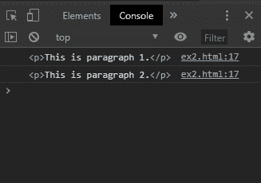
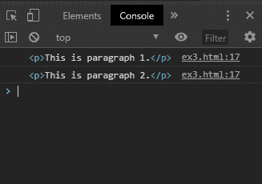

# 循环的 HTMLCollection

> 原文: [https://www.geeksforgeeks.org/htmlcollection-for-loop/](https://www.geeksforgeeks.org/htmlcollection-for-loop/)

不建议使用 `for/in` 循环来遍历 `HTMLCollection`，因为这种类型的循环用于遍历对象的属性。`HTMLCollection` 包含可能与所需元素一起返回的其他属性。

有 3 种方法可以用来在 `HTMLCollection` 中正确循环。

## 方法 1: 使用 `for/of` 循环

`for/of` 循环用于遍历可迭代对象的值。这包括数组、字符串、`nodeLists` 和 `HTMLCollections`。

此循环的语法类似于 `for/in` 循环。该对象必须可迭代才能用于此循环。

**语法:**

```html
for (item of iterable) {
    // code to be executed
}
```

**示例:**

```html
<!DOCTYPE html>
<html>

<head>
    <title>For loop for HTMLCollection elements</title>
</head>

<body>
    <h1 style="color: green">GeeksforGeeks</h1>
    <b>For loop for HTMLCollection elements</b>
    <p>This is paragraph 1.</p>
    <p>This is paragraph 2.</p>
    <script type="text/javascript">
        // get a HTMLCollection of elements in the page
        let collection = document.getElementsByTagName("p");

        // regular for loop
        for (let i = 0; i < collection.length; i++) {
            console.log(collection[i]);
        }
    </script>
</body>

</html>
```

**控制台输出:**


## 方法 2: 使用 `Array.from()` 方法将 `HTMLCollection` 转换为 `Array`

`Array.from()` 方法用于从类似数组的或可迭代对象创建一个新的 `Array`。将 `HTMLCollection` 传递给此方法以将其转换为 `Array`。

`forEach()` 方法现在可以用来像数组一样迭代元素并显示它们。

**语法:**

```html
Array.from(collection).forEach(function (element) {
    console.log(element)
});
```

**示例:**

```html
<!DOCTYPE html>
<html>

<head>
    <title>For loop for HTMLCollection elements</title>
</head>

<body>
    <h1 style="color: green">GeeksforGeeks</h1>
    <b>For loop for HTMLCollection elements</b>
    <p>This is paragraph 1.</p>
    <p>This is paragraph 2.</p>
    <script type="text/javascript">
        // get a HTMLCollection of elements in the page
        let collection = document.getElementsByTagName("p");

        // convert to an array using Array.from()
        Array.from(collection).forEach(function(element) {
            console.log(element)
        });
    </script>
</body>

</html>
```

**输出:**


## 方法 3: 使用常规 `for` 循环

可以通过使用常规 `for` 循环来迭代元素。可以通过使用集合的 `length` 属性来找出 `HTMLCollection` 中的元素数量。然后运行一个 `for` 循环到元素的数量。

每个项目都可以通过使用带有各自索引的方括号来访问。

**语法:**

```html
for (let i = 0; i < collection.length; i++) {
    console.log(collection[i]);
}
```

**示例:**

```html
<!DOCTYPE html>
<html>

<head>
    <title>For loop for HTMLCollection elements</title>
</head>

<body>
    <h1 style="color: green">GeeksforGeeks</h1>
    <b>For loop for HTMLCollection elements</b>
    <p>This is paragraph 1.</p>
    <p>This is paragraph 2.</p>
    <script type="text/javascript">
        // get a HTMLCollection of elements in the page
        let collection = document.getElementsByTagName("p");

        // convert to an array using Array.from()
        Array.from(collection).forEach(function(element) {
            console.log(element)
        });
    </script>
</body>

</html>
```

**输出:**

