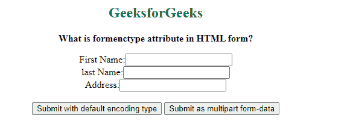

# 什么是 HTML 表单中的 `formenctype` 属性？

> 原文：[https://www.geeksforgeeks.org/what-is-formenctype-attribute-in-html-form/](https://www.geeksforgeeks.org/what-is-formenctype-attribute-in-html-form/)

HTML `formenctype` 属性用于指定提交表单时使用的编码类型。它定义了表单数据发送到服务器时应该如何编码。

它的工作原理是输入类型 `submit` 和输入类型 `image`。

当表单内有多个提交按钮时，使用 `formenctype` 属性。它用于覆盖 `<form>` 元素的 `enctype` 属性。

## 语法

`<element_name formenctype="application/x-www-form-urlencoded/multipart/form-data/text/plain"></element_name>`

基本上，有几种方法可以用来编码表单数据。

### `application/x-www-form-urlencoded`
为默认值。在发送到服务器之前，它会对所有字符进行编码。它将空格转换为 `+` 符号，将特殊字符转换为十六进制值。

### `multipart/form-data`
用于对文件上传控件进行编码。该值不编码任何字符。如果不使用这种编码类型，我们就无法上传图像和文件。

### `text/plain`
该值将空格转换为 `+` 符号，但不转换特殊字符。

## 示例

```html
<!DOCTYPE html>
<html>

<body>
    <center>
        <h2 style="color:green">
            GeeksforGeeks
        </h2>

<p><b>
            What is formenctype attribute in HTML form?
        </b></p>

<form action="#">
            <label>First Name:<input type="text"></label>
            <br>

<label>last Name:<input type="text"></label>
            <br>

<label>Address:<input type="text"></label>
            <br><br>

<input type="submit" value=
                "Submit with default encoding type">

<button type="submit" 
                formenctype="multipart/form-data">
                Submit as multipart form-data
            </button>
        </form>
    </center>
</body>

</html>
```

## 输出

