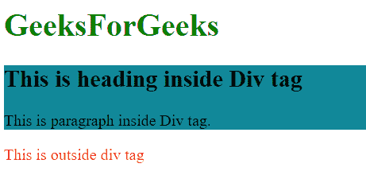
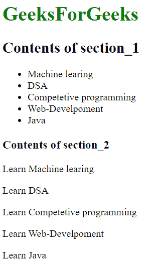

# HTML中`<section>`和`<div>`标签的区别

> 原文: [https://www.geeksforgeeks.org/what-is-the-difference-between-section-and-div-tags-in-html/](https://www.geeksforgeeks.org/what-is-the-difference-between-section-and-div-tags-in-html/)

这两个标签（[`<div>`](https://www.geeksforgeeks.org/div-tag-html/) 和 [`<section>`](https://www.geeksforgeeks.org/html-section-tag/#:~:text=Section%20tag%20defines%20the%20section,other%20section%20of%20documents%20needed.)）都在网页中使用。`<section>` 标签表示里面的内容与一个主题相关。

## HTML `<div>` 标签

它被称为分部标签。`<div>` 标签是块级元素，只表示其子元素，没有特殊含义。它采用屏幕上可用的整个宽度。它通常与标题和类属性一起使用。`<div>` 标签是网站创建中最常用的标签之一。将 `<div>` 元素用于样式目的，或者用于在一个都被赋予相似属性的部分中包装段落。也需要关闭 `</div>` 标签。

**注:** 建议使用 `<div>` 元素作为最后选项，并使用其他各种标签，如 `<main>`、`<article>` 或 `<nav>`，因为这种做法对读者来说更方便。

**句法:**

```html
<div>
  <h1>Title</h1>
  <p>Information goes here....</p>
</div>
```

**例:** 本例显示 `<div>` 标记。

```html
<!DOCTYPE html>
<html>
  <head>
    <title>Div example</title>
  </head>
  <body>
    <h1 style="color:green">GeeksForGeeks</h1>
    <div style="background-color:#189">
      <h2>This is heading inside Div tag</h2>
      <p>This is paragraph inside Div tag.</p>
    </div>
    <p style="color:red">This is outside div tag</p>
  </body>
</html>
```

**输出:**



## HTML `<section>` 标签

`<section>` 标签不是网页中的通用容器。`<section>` 标签中的内容将被分组，也就是说，它将连接到一个单一的主题，并作为一个条目出现在页面的大纲中。一个常见的规则是 `<section>` 元素只有在文档大纲中明确列出该元素的内容时才有效。Section 标记用于分发具有相似主题的内容。区段标签的主要优点是，它在网页中描述了它的含义。当网页中需要页眉、页脚或文档的任何其他部分时，通常使用它。也需要关闭 `</section>` 标签。

**语法:**

```html
<section>
  <h1>Title</h1>
  <p>Information goes here....</p>
</section>
```

**示例:** 此示例显示了 `<section>` 标记。

```html
<!DOCTYPE html>
<html>
  <head>
    <title>Title of the document</title>
  </head>
  <body>
    <h1 style="color:green">GeeksForGeeks</h1>
    <section>
      <h2>GeeksForGeeks </h2>
      <ul>
        <li>Machine learing</li>
        <li>DSA</li>
        <li>Competetive programming</li>
        <li>Web-Development</li>
        <li>Java</li>
      </ul>
    </section>
    <section>
      <h3>Books</h3>
      <p>Learn Machine learing</p>
      <p>Learn DSA</p>
      <p>Learn Competetive programming</p>
      <p>Learn Web-Development</p>
      <p>Learn Java</p>
    </section>
  </body>
</html>
```

**输出:**



## 之间的差异

- `<div>` 是一个通用容器。它表示其子元素，但没有特殊含义。
- `<section>` 也是一个容器，但它表示其子元素与一个单一主题相关，并具有语义含义。
- `<div>` 没有任何特定的语义含义。
- `<section>` 在网页中描述了其内容的含义。
- 在网页中使用 `<div>` 元素通常用于样式目的。
- 当需要页眉、页脚或文档的任何其他章节时，使用 `<section>`。