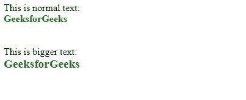

# 为什么 `<big>` 标签不在 HTML5 中而 `<small>` 标签存在？

> 原文: [https://www.geeksforgeeks.org/why-big-tag-is-not-in-html5-while-small-tag-exists/](https://www.geeksforgeeks.org/why-big-tag-is-not-in-html5-while-small-tag-exists/)

`<big>` 标签在 HTML5 中已经停产，而 `<small>` 标签仍然可以派上用场，因为 `<small>` 标签经常被用来表示脚注、版权声明、评论等小的印刷品。很多 `<big>` 标签的替代品已经有了，比如 `<h1>`、`<h2>` 等等。在 HTML5 中不使用 `<big>`，可以使用 CSS 创建更大的文本。

## `<big>` 标签

HTML `<big>` 标签使 HTML 文档中的字体变大了一个尺寸。小的转换成中的，中的转换成大的，同样大的转换成 x-大的。

### 语法

```html
<big> Text... </big>
```

### 示例

```html
<!DOCTYPE html>
<html>

<head>
    <style>
        div {
            font-weight: bold;
            color: green;
        }
    </style>
</head>

<body>
    This is normal text:
    <div>GeeksforGeeks</div>
    <br></br>
    This is bigger text:
    <div><big>GeeksforGeeks</big></div>
</body>

</html>
```

### 输出


## `<small>` 标签

HTML `<small>` 标签定义了更小的文本。它使文本比可用文本小一种字体。x-large 转换为大，large 转换为中，类似地，medium 转换为 small。

### 语法

```html
<small> Text... </small>
```

### 示例

```html
<!DOCTYPE html>
<html>

<head>
    <style>
        div {
            font-weight: bold;
            color: green;
        }
    </style>
</head>

<body>
    This is normal text:
    <div>GeeksforGeeks</div>
    <br></br>
    This is smaller text:
    <div><small>GeeksforGeeks</small></div>
</body>

</html>
```

### 输出


## 浏览器支持

`<big>` 和 `<small>` 标签具有以下浏览器支持：

*   谷歌 Chrome
*   火狐浏览器
*   微软公司出品的 web 浏览器
*   歌剧
*   旅行队