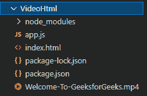
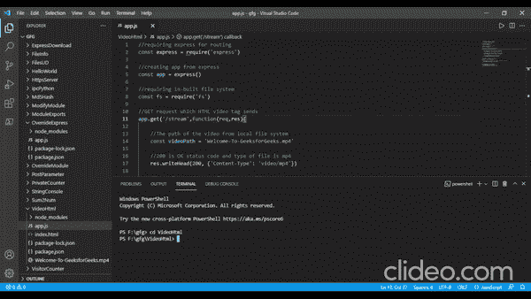

# 如何创建一个简单的 HTTP 服务器在 3000 端口监听服务视频？

> 原文：[https://www.geeksforgeeks.org/how-to-create-a-simple-http-server-listening-at-port-3000-to-serve-video/](https://www.geeksforgeeks.org/how-to-create-a-simple-http-server-listening-at-port-3000-to-serve-video/)

借助 `express` 和内置的 Node.js 文件系统 `fs`，我们可以使用 Node.js 向浏览器/前端提供视频。在这里，我们将使用 HTML 视频标签来查看网页上的视频。我们会使用 `express` 作为路由。我们将通过创建一个读取流并将 `res` 对象传送到它来发送视频字节。让我们一步步走过去。

## 步骤 1：初始化项目

创建一个 `app.js` 文件，用 `npm init` 初始化项目。此外，将您想要传输的视频文件保存在同一文件夹中。

```bash
npm init
```

## 步骤 2：安装依赖并创建 HTML 文件

现在安装 `express`，创建 `index.html` 文件。

```bash
npm install express
```

**项目结构：** 如下图。



项目结构

这里的 `Welcome-To-GeeksforGeeks.mp4` 就是我们要流的 mp4 文件。

## 步骤 3：编写服务器代码

我们现在对 `app.js` 文件进行编码。对 `/stream` 的 GET 请求将视频作为可读流发送。应用程序的根目录加载 `index.html` 文件。我们使用 `res.writeHead()` 函数发送状态消息为 200，表示 OK，内容类型为 `video/mp4`。我们现在将使用 `fs.createReadStream()` 函数创建一个读取流，将视频作为 HTML 视频标签的可读流发送。

### app.js

```javascript
// Requiring express for routing
const express = require('express')

// Creating app from express
const app = express()

// Requiring in-built file system
const fs = require('fs')

// GET request which HTML video tag sends
app.get('/stream',function(req,res){

// The path of the video from local file system
    const videoPath = 'Welcome-To-GeeksforGeeks.mp4'

// 200 is OK status code and type of file is mp4
    res.writeHead(200, {'Content-Type': 'video/mp4'})

// Creating readStream for the HTML video tag
    fs.createReadStream(videoPath).pipe(res)
})

// GET request to the root of the app
app.get('/',function(req,res){

// Sending index.html file for GET request
    // to the root of the app
    res.sendFile(__dirname+'/index.html')
})

// Creating server at port 3000
app.listen(3000,function(req,res){
    console.log('Server started at 3000')
})
```

## 步骤 4：编写前端页面

现在我们将对 `index.html` 文件进行编码。这里我们使用 `controls` 属性来提供视频标签中媒体播放器的各种控件。而 `autoplay` 是一个布尔属性，通过这个属性，视频可以在不停止加载数据的情况下，尽快自动开始播放。HTML 视频标签的 `src` 属性是 `app.js` 文件中定义的 `/stream`。

### index.html

```html
<!DOCTYPE html>
<html lang="en">

<head>
    <meta charset="UTF-8" />
    <meta http-equiv="X-UA-Compatible"
        content="IE=edge" />
    <meta name="viewport" content=
        "width=device-width, initial-scale=1.0" />
    <title>Video Stream</title>
</head>

<body>
    <!--  autoplay: A Boolean attribute; if 
        specified, the video automatically 
        begins to play back as soon as it can 
        do so without stopping to finish 
        loading the data -->

<video controls autoplay width="500px" height="500px">

<!-- GET request to the stream route -->
        <source src="/stream" type="video/mp4" />
    </video>
</body>

</html>
```

## 步骤 5：运行并查看输出

现在使用 `node` 运行应用程序。

```bash
node app.js
```

**输出：** 前往浏览器，输入 `http://localhost:3000/`



输出